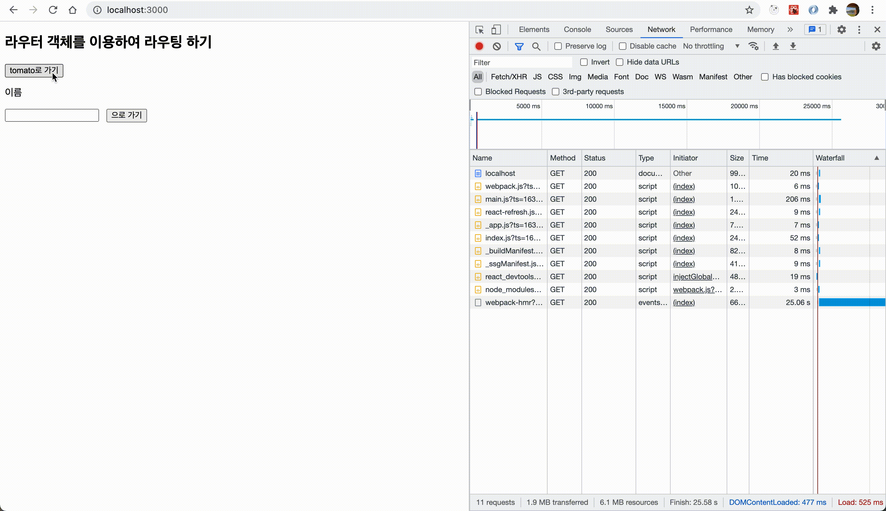

# 🔥 넥스트 프레임워크에 타입스크립트 적용하기

## 목차

- [Next 를 쓰는 이유 🔥](#Next-를-쓰는-이유)
- [프로젝트 초기화하기 🔥](#프로젝트-초기화하기)
- [eslint 및 prettier 설정하기 🔥](#eslint-prettier-설정하기)
- [next의 라우팅 적용하기 🔥](#라우팅-적용하기)
- [서버시이드 렌더링을 사용하여 페이지네이션이 가능한 깃허브 클론하기 🔥](#서버시이드-렌더링을-사용하여-페이지네이션이-가능한-깃허브-클론하기)
- [next 추가 설정, 페이지 및 폴더 🔥](#next-추가-기본-설정하기)

## 들어가기 앞서

- SPA의 SSR, SEO와 관련된 문제를 해결하기 위해 Next.js를 많은 기업에서 사용하는 추세입니다
- 앞서 배웠던 React by Ts를 통해 typescript의 정적 타이핑에 대해서 어느정도 숙지한 상태에서 보는 것을 추천합니다!

## Next 를 쓰는 이유

### 사전 렌더링 및 서버 사이드 렌더링

### Hot Code Reloading을 지원

Next 개발 환경에서는 코드 변경 사항이 저장되면 응용 프로그램을 자동으로 다시 로드합니다.

### 자동 코드 분할

자동 코드 분할 기능 덕분에 코드의 모든 가져오기각 번들로 묶여 각 페이지와 함께 제공됩니다. 결과적으로, 불필요한 코드가 페이지에 로드되지 않게 됩니다.

### 설정이 필요없음

넥스트는 기본적으로 웹팩과 바벨을 사용하고 있습니다. 이미 서버 사이드 렌더링 및 개발에 필요한 설정이 되어 있으므로 빠르게 개발을 시작할 수 있습니다.

사용하고 싶은 플러그인이 있다면 손쉽게 추가하여 사용할 수 있도록 지원을 하고 있습니다.

### 타입스크립트가 내장됨

### 파일기반 내비게이션 기능

리액트에서는 라우트를 위해서 'react-router'라는 라이브러리를 사용하여 라우팅 설정을 해주어야 합니다.

그로 인해 페이지의 경로에 대하여 직접 설정을 해주어야 하였습니다.

하지만 넥스트는 파일 시스템 기반 라우팅을 사용합니다.

폴더의 경로에 따라 페이지의 경로가 설정되어 구축이 빠르고 관리가 편리하다는 장점이 있습니다.

### styled-jsx 지원

## 프로젝트 초기화하기

- next 프레임워크를 사용하는 방법은 크게 두가지입니다

① CRA 처럼 사용가능한 CNA(create-next-app) 명령어를 통해 초기화

```
$ npx create-next-app 프로젝트명
```

② 직접 init 하기

```
mkdir 프로젝트명

cd 프로젝트명

npm init -y 를 통해 package.json 직접 초기화
```

## eslint prettier 설정하기

```
$ eslint --init
```

해당 명령어를 통해 우리가 필요한 상황에 맞춰 eslint를 설정해줄 수 있습니다.

흔히 사용되는 초기화 과정은 다음과 같습니다.

```
leejunhee@JunHees-MacBook next-app % eslint --init
✔ How would you like to use ESLint? · style
✔ What type of modules does your project use? · esm
✔ Which framework does your project use? · react
✔ Does your project use TypeScript? · No / Yes
✔ Where does your code run? · browser
✔ How would you like to define a style for your project? · guide
✔ Which style guide do you want to follow? · airbnb
✔ What format do you want your config file to be in? · JavaScript
```

개발에 필요한 eslint rules를 .eslintrc.js 모듈에 추가할 수 있습니다.

```js
module.exports = {
  env: {
    browser: true,
    es6: true,
  },
  extends: ["airbnb"],
  globals: {
    Atomics: "readonly",
    SharedArrayBuffer: "readonly",
  },
  parserOptions: {
    ecmaFeatures: {
      jsx: true,
    },
    ecmaVersion: 2018,
    sourceType: "module",
  },
  plugins: ["react"],
  rules: {
    quotes: ["error", "single"], // 싱글 쿼터 사용
    "no-unused-vars": "off", // 사용안한 변수 경고 중복
    "jsx-a11y/control-has-associated-label": "off", // 상호작용하는 엘리먼트에 label을 넣는다
    "react/no-array-index-key": "off", // key값으로 index를 사용할수 있다.
    "comma-dangle": "off", // 마지막에 , 을 넣어주지 않는다.
    "arrow-body-style": "off", // 화살표 함수 안에 return을 사용 할 수 있다.
    "react/no-unescaped-entities": "off", // 문자열 내에서 " ' > } 허용
    "react/prop-types": "off", // proptypes를 사용하지 않는다.
    "object-curly-newline": "off", // { 다음 줄 바꿈을 강제로 사용하지 않는다.
    "react/jsx-one-expression-per-line": "off", // 한라인에 여러개의 JSX를 사용 할 수 있다.
    "implicit-arrow-linebreak": "off", // 화살표 함수 다음에 줄 바꿈을 사용할 수 있다.
    "no-shadow": "off", // 파일 내에서 중복 이름을 사용 할 수 있다.
    "operator-linebreak": "off", // 연산자 다음 줄 바꿈을 사용 할 수 있다.
    "react/react-in-jsx-scope": "off", // jsx를 사용하여도 React를 꼭 import 하지 않아도 된다.
    "react/jsx-props-no-spreading": "off", // props를 스프래드 할 수 있다.
    "jsx-a11y/anchor-is-valid": "off", // next js에서는 a에 href없이 사용
    "global-require": "off", // 함수 내에서 require 사용가능
    "jsx-a11y/label-has-associated-control": "off", // label은 항상 control이 없어도 된다.
    "react/jsx-curly-newline": "off", // 새 라인에 {} 사용 가능하다.
    "react/jsx-filename-extension": [
      1,
      { extensions: [".js", ".jsx"] }, // jsx사용가능한 확장자 설정
    ],
    "import/extensions": [
      "error",
      "ignorePackages",
      {
        js: "never",
        jsx: "never",
        ts: "never",
        tsx: "never",
      }, // import 시 확장자명은 사용하지 않는다.
    ],
  },
  settings: {
    "import/resolver": {
      node: {
        extensions: [".js", ".jsx", ".ts", ".tsx", ".d.ts"],
      },
    },
  },
};
```

## 라우팅 적용하기

Next 프레임워크를 사용시에는 파일기반의 네비게이션 구조를 갖추기 때문에 따로 react-router 설정을 해 줄 필요가 없습니다.

pages 폴더 내에 Next.js에서 제공하는 Link 컴포넌트를 통해 해당 구조에 맞춰 작성하면 라우팅이 가능합니다

```js
import Link from "next/link";
```

```js
<Link href="/tomato">
  <a>Move to '/tomato'</a>
</Link>
```

### 동적(다이나믹) 라우팅 적용하기

pages 폴더 내부에 동적으로 라우팅할 폴더를 생성하고 우리가 받고자하는 쿼리 명으로 이름을 지어보겠습니다.

```
📁 vegetable
  - [name].jsx
```

우리는 next/router 가 제공하는 useRouter를 통해 다이나믹 라우팅을 구현할 수 있습니다.

router 객체의 속성 중 query 속성 안에 들어있는 프로퍼티를 통해 동적 라우팅이 가능해집니다.

router.query.xxx는 우리가 동적 라우팅을 위해 생성한 폴더 내부의 파일 `[ ]` 안에 들어있는 이름과 같아야 합니다

```js
📁 index.jsx
...

<Link href="/vegetable/potato">
  <a>Move to '/vegetable/potato'</a>
</Link>
```

```js
📁 vegetables/[name].jsx

const name = () => {
  const router = useRouter();
  const { name } = router.query;

  // router.query 안에 들어있는 객체는 우리가 다이나믹 라우팅 시에 지정해준 [name].jsx 의 name으로 나오게 된다
  return (
    <div>
      <h2>Hello! {name}</h2>
      <Link href="/">Move to '/'</Link>
    </div>
  );
};

export default name;

```

만약 `[id]`.jsx 로 설정해두었다면 router.query 내부에는 name이 아닌 id가 들어있을 것입니다

```
const name = router.query.name

const id = router.query.id
```

### 라우터 객체를 이용하여 동적(다이나믹) 라우팅 적용하기

링크 태그를 사용하지 않더라도 우리는 기본적으로 Next 프레임워크에서 제공되는 라우팅 기능을 통해 동적으로 라우팅을 할 수 있습니다.

앞서 다뤘던 다이나믹 라우팅과 같이 useRouter 모듈에서 제공하는 기능을 사용합니다

```js
import React, { useState } from "react";
import { useRouter } from "next/router";

const index = () => {
  const [name, setName] = useState("");
  const router = useRouter();
  return (
    <div>
      <h2>라우터 객체를 이용하여 라우팅 하기</h2>
      <div>
        <button type="button" onClick={() => router.push("/tomato")}>
          tomato로 가기
        </button>
        <p>이름</p>
        <input
          value={name}
          onChange={(e) => setName(e.target.value)}
          style={{ marginRight: "12px" }}
        />
        <button type="button" onClick={() => router.push(`/vegetable/${name}`)}>
          {name}으로 가기
        </button>
      </div>
    </div>
  );
};

export default index;
```



해당 정보를 받아줄 수 있는 동적인 페이지가 존재한다면 위처럼 내가 입력하는 e.target.value를 바탕으로 한 동적인 페이지를 생성할 수 있습니다

## 서버시이드 렌더링을 사용하여 페이지네이션이 가능한 깃허브 클론하기

[레포지토리 보기](https://github.com/junh0328/learning_typescript/tree/master/NextByTS/next-app)

Next 프레임 워크를 사용하는 이유는 앞서 배운 것처럼 리액트를 사용했을 때는 적용하기 힘든 검색 엔진 최적화 (SEO), 타입스크립트 지원, 코드 스플리팅, 파일 기반의 네비게이션 기능을 사용할 수 있기 때문입니다.

Next에서 가장 중요하다고 볼 수 있는 사전 렌더링(pre-render) 기능에 대해서 공부하면서, 이를 적용하여 깃허브 프로필 페이지를 클론하는 과정을 통해 학습해 보겠습니다.

<!-- Next에는 두 가지 형태의 사전 렌더링이 존재합니다.

1. 정적 생성 (SSG) : next build (빌드) 시에 페이지를 HTML로 만들어 요청 시 제공합니다.
2. 서버 사이드 렌더링 (SSR) : 페이지 요청 시 서버 사이드 렌더링을 통하여 HTML을 제공합니다.

SSG, Static Site Generation은 말 그대로 정적 사이트 생성입니다.

Build 타임 때 (next build를 했을 때) 정적인 HTML 파일들이 서버에 셍성되는 것을 의미합니다.

그러므로 유저가 페이지를 요청했을 때 이미 생성된 HTML만 반환하면 되므로, 이 HTML들은 재사용할 수 있습니다.

이미 생성된 파일이 있기에 다른 유저가 같은 url로 요청했을 때 어떠한 작업도 하지않고 HTML만 반환하면 되므로 응답속도 (초기 렌더링 속도)가 매우 빠르다.

SSG 시에, ① 외부 데이터를 필요로 하지 않는다면, 넥스트는 빌드 시에 페이지를 렌더링하여 요청시마다 제공하게 됩니다.

② 외부 데이터를 필요로 한다면 서버 사이드 렌더링을 통하여 외부 데이터를 이용하여 렌더링을 한 후 HTML을 제공하게 됩니다.

이때 서버 사이드 렌더링에 대하여 넥스트는 옵션을 제공합니다. -->

### 📁 폴더 구조

현재 레포지토리는 아래와 같은 구조로 구성되어 있습니다.

```
📁 components

- Header
- Profile
- Repositories

📁 pages
- 📁 user (다이나믹 라우팅을 위한 페이지)
  - [name].jsx
- index
```

### 🔥 start

index 페이지에 접근하여 next/link의 Link 기능을 통해 우리가 입력한 아이디를 바탕으로 동적 라우팅을 진행합니다.

```jsx
📁 pages/index.jsx
...

const index = () => {
  const [userName, setUserName] = useState("");

  return (
    <>
      <br />
      <div>
        <label>
          username
          <input
            value={userName}
            onChange={(e) => setUserName(e.target.value)}
          />
        </label>
        <p>{userName} 깃허브 검색하기</p>
        <Link href={`/users/${userName}`}>
          <a>검색하기</a>
        </Link>
      </div>
    </>
  );
};

export default index;
```

`<Link href={`/users/${userName}`}>` 를 통해 useState로 관리하고 있는 userName을 쿼리문으로 하여금 `📁 user/[name].jsx` 에서 state인 userName을 받아줍니다.

```jsx
📁 user/[name].jsx

// 서버사이드 렌더링 부분

...

export const getServerSideProps = async ({ query }) => {
  // ① 초기 페이지를 1로 줬다
  const { name, page = '1' } = query;
  try {
    let user;
    let repos;

    // ②
    const userRes = await fetch(`https://api.github.com/users/${name}`, {
      method: 'GET',
      headers: {
        'content-Type': 'application/json',
      },
    });
    if (userRes.status === 200) {

      // ③
      user = await userRes.json();
    } else {
      throw Error(userRes.statusText);
    }

    // ②
    const reposRes = await fetch(
      `https://api.github.com/users/${name}/repos?sort=updated&page=${page}&per_page=10`,
      {
        method: 'GET',
        headers: {
          'content-Type': 'application/json',
        },
      }
    );
    if (reposRes.status === 200) {

      // ③
      repos = await reposRes.json();
    } else {
      throw Error(userRes.statusText);
    }
    // ④
    return { props: { user, repos } };
  } catch (e) {
    console.log(e);
    return { props: {} };
  }
};


```

### ①

window.query 즉, 쿼리 객체 안에 들어있는 우리가 지어준 `[name]` 을 기반으로 한 name을 구조분해 할당을 통해 추출합니다.

page는 기본적으로 초기 렌더링 시에는 들어있지 않지만, 기본값을 1로 해서 넘겨줍니다.

레포지토리를 10개씩 받아오게 되는데 다음 10개를 불러오거나, 이전 10개를 불러오기 위해 필요합니다.

### ②

```
https://api.github.com/users/${name}
```

해당 URL은 깃허브에서 제공하는 유저 정보를 불러올 수 있는 API입니다. name은 쿼리문으로 받아온 정보를 넣어줍니다.

```
https://api.github.com/users/${name}/repos?sort=updated&page=${page}&per_page=10
```

해당 URL은 깃허브에서 제공하는 유저가 생성한 레포지토리 정보를 불러오는 API입니다. page 별, 몇 개의 레포지토리를 불러올 지 설정이 가능합니다.

### ③

SSR을 실행할 때 해당 API를 통해 결과물로 담을 userRes, reposRes 라는 변수를 만들어 HTTP 요청을 통해 넘겨받은 정보는 Response 객체에 담겨 전달되는 형식이기 때문에 이를 우리가 흔히 아는 data 구조로 사용하기 위해서 `Response.json()` 메서드를 사용하여 복호화해줍니다.

### ④

마지막으로 복호화된 데이터를 props에 객체형식으로 담아 리턴해주면, getServerSideProps 진행 시에 서버쪽에서 해줘야 하는 사전 작업들이 끝나게 됩니다.

```jsx
📁 user/[name].jsx

...

const name = ({ user, repos }) => {
  return (
    <div className="user-contents-wrapper">
      <Profile user={user} />
      <Repositories user={user} repos={repos} />
      <style jsx>{style}</style>
    </div>
  );
};
```

이렇게 getServerSideProps 를 통해 props로 리턴받은 객체 user와 repos를 컴포넌트로 분리한 `<Profile>`과 `<Repositories>` 컴포넌트에게 각각 전달해줍니다.

```jsx
📁 components/Profile

...

const Profile = ({ user }) => {

  // ①
  if (!user) {
    return null;
  }

  return (
    <>
      <div className="profile-box">
        <div className="profile-image-wrapper">
          
        </div>
        <h2 className="profile-username">{user.name}</h2>
        <p className="profile-user-login">{user.login}</p>
        <p className="profile-user-bio">{user.bio}</p>
        <p className="profile-user-info">
          <GoOrganization size={16} color="#6a737d" />
          <span className="profile-user-info-text">
            {/* ② */}
            {user.company ? user.company : 'company 없음'}
          </span>
        </p>
        <p className="profile-user-info">
          <GoMail size={16} color="#6a737d" />
          <span className="profile-user-info-text">
            {/* ② */}
            {user.email ? user.email : 'email 없음'}
          </span>
        </p>
        <p className="profile-user-info">
          <GoLocation size={16} color="#6a737d" />
          <span className="profile-user-info-text">
            {/* ② */}
            {user.location ? user.location : 'location 없음'}
          </span>
        </p>
      </div>

      <style jsx>{style}</style>
    </>
  );
};
export default Profile;

```

### ①

만약 user 객체의 값이 비어있다면, null을 반환하여 렌더링이되지 않도록 처리합니다.

이미 getServerSideProps를 통해 `reposRes.status === 200` 일 때만 객체가 반환되도록 처리를 해 두었습니다.

하지만 우리가 예상치 못한 상황에 발생할 수 있는 오류를 대비하여 user 객체의 값이 비어있을 경우를 대비해줍니다.

나머지는 객체에 들어있는 property 들을 렌더링하는 구조입니다.

### ②

사용자가 location / email / company를 입력하지 않은 경우를 생각하여 조건부 렌더링을 적용해줍니다

빈 값으로 처리한다면 최종 결과물이 의도와 달라질 수 있고, 어느 부분에서 어떤 데이터가 비어있는지 파악이 되지 않을 수 있습니다.

```js
📁 components/Repositories

...

const Repositories = ({ user, repos }) => {
  // ①
  const router = useRouter();
  // ②
  const { page = '1' } = router.query;

  // ③
  if (!user || !repos) {
    return null;
  }

  return (
    <>
      <div className="repos-wrapper">
        <div className="repos-header">
          Repositoreis
          <span className="repos-count">{user.public_repos}</span>
        </div>
        {user &&
          repos &&
          repos.map((repo) => (
            <div key={repo.id} className="repository-wrapper">
              <a
                target="_blank"
                rel="noopener noreferrer"
                href={`https://github.com/${user.login}/${repo.name}`}
              >
                <h2 className="repository-name">{repo.name}</h2>
              </a>
              <p className="repository-description">{repo.description}</p>
              <p className="repository-language">
                {repo.language}
                <span className="repository-updated-at">
                  {formatDistance(new Date(repo.updated_at), new Date(), {
                    addSuffix: true,
                  })}
                </span>
              </p>
            </div>
          ))}
        <div className="repository-pagination">
          {/* ④ */}
          <Link href={`/users/${user.login}?page=${Number(page) - 1}`}>
            <a>
              {/* ⑥ */}
              <button type="button" disabled={page && page === '1'}>
                Previous
              </button>
            </a>
          </Link>
          {/* ⑤ */}
          <Link
            href={`/users/${user.login}?page=${!page ? '2' : Number(page) + 1}`}
          >
            <a>
              <button type="button" disabled={repos.length > 10}>
                Next
              </button>
            </a>
          </Link>
        </div>
        <style jsx>{style}</style>
      </div>
    </>
  );
};

export default Repositories;

```

### ①

next 에서 지원하는 `import { useRouter } from 'next/router';` 라우터를 사용합니다

useRouter() 에 사전에 구성된 router 메서드를 사용하여 props로 전달받지 않아도 해당 페이지에서 쿼리문을 캐치할 수 있습니다.

### ②, ④, ⑤

```js
const { page = "1" } = router.query;
```

router.query에 들어있는 page 를 사용합니다.

풀어 쓰지 않는다면 const page = router.query.page 가 될 것 입니다.

여기서 처음 렌더링시에 Link href로 초기 페이지를 넘겨주지 않기 때문에 우선 매개변수에 기본값을 설정해주었습니다.

④ 와 ⑤에서 볼 수 있듯이, 첫 번째 렌더링되는 페이지가 아닐 경우에는 page를 같이 넘겨주게 됩니다

**예를 들어 초기 페이지 1을 가진 상태에서 Next 에 해당되는 Link를 클릭했다고 가정해 봅시다**

index 페이지에서 처음 주소를 입력한다면 다음과 같은 URL이 입력될 것입니다

```
http://localhost:3000/users/junh0328
```

page는 첫 페이지이기 때문에 매개변수에 기본값을 설정해서 1을 넣어주었고 다음 페이지로 넘어갈 때부터 page를 포함한 요청을 보내게 됩니다

`📁 components/Repositories`에서 Next 버튼을 본다면, page가 아직 router.query를 통해 넘겨받지 못했기 때문에 '2'로 갈 수밖에 없습니다.

```js
  <Link href={`/users/${user.login}?page=${!page ? '2' : Number(page) + 1}`}>
```

Next를 눌러볼까요?

```
http://localhost:3000/users/junh0328?page=2
```

Next 버튼을 누름과 동시에 Link에 현재 기본 매개변수로 받은 page에 1 더한 값인 page=2 로 라우팅 요청을 보냈습니다.

따라서 주소창에서는 page가 기본 매개변수 1이 아닌, 2가 들어가게 됩니다

이때 부터는 Previous 버튼 또한 사용할 수 있게 됩니다

### ③

앞서 `<Profile>` 컴포넌트 단에서 처리했던 것처럼 getServerSideProps를 통해 넘겨받은 자료가 없을 경우가 있을 수도 있습니다.

따라서, props 넘겨받은 객체가 비어있을 때는 null을 반환하여 불필요한 에러가 생기지 않도록 처리해주었습니다.

## next 추가 기본 설정하기

Next 프레임워크는 프레임워크에서 제공하는 특별한 폴더와 파일들이 있습니다.

- 📁 public: 정적 파일을 저장하여 제공
- 📁 pages: 폴더 구조를 이용하여 경로를 설정

📁 pages 폴더 안에는 넥스트에서 중요한 역할을 하는 특별한 파일들이 있습니다.

- 📙_app.jsx (tsx)
- 📙_document.jsx (tsx)
- 📙_error.jsx (tsx)
- 📙404.jsx (tsx)

### 📙_app.jsx

App 컴포넌트는 모든 페이지의 공통 페이지 역할을 합니다.

App 컴포넌트를 이용하여 모든 페이지들을 초기화하여 다음과 같은 역할을 할 수 있습니다.

1. 페이지들의 공통된 레이아웃
2. 페이지를 탐색할 때 상태 유지
3. 추가 데이터를 페이지에 주입
4. 글로벌 CSS 추가

```jsx
📁 pages/_app.jsx

import Header from '../components/Header';

const MyApp = ({ Component, pageProps }) => {
  return (
    <>
      <Header />
      <Component {...pageProps} />
      <style jsx global>
        {`
          body {
            margin: 0;
          }
        `}
      </style>
    </>
  );
};

export default MyApp;
```

- 사전에 만들어둔 Header 컴포넌트를 \_app.jsx 파일에 추가한다면, 모든 파일에서 공통적으로 Header를 갖게 됩니다
- next에서 기본적으로 제공하는 style jsx에 global을 추가하면 전역으로 적용되는 글로벌 스타일을 지정할 수 있습니다.

### 📙_document.jsx

사용자 정의 Document는 일반적으로 응용 프로그램 `<HTML>` 및 `<body>` 태그를 보강하는데 사용됩니다.

도큐먼트를 이용하여 `<title>`, `<description>`, `<meta>` 등 프로젝트의 정보를 제공하는 HTML 코드를 작성할 수 있고,

폰트나 외부 api, cdn 등을 불러오도록 할 수 있습니다.

또한 CSS-in-JS의 서버 사이드 렌더링을 위한 설정을 할 때 사용합니다.

```jsx
📁 pages/_document.jsx

import Document, { Html, Head, Main, NextScript } from 'next/document';

class MyDocument extends Document {
  render() {
    return (
      <Html lang="ko">
        <Head>
          <meta name="title" content="깃허브 레포지토리" />
          <meta name="description" content="깃허브 레퍼지토리 리스트입니다" />
          <link
            href="https://fonts.googleapis.com/css?family=Noto+Sans:400,700&display=swap"
            rel="stylesheet"
          />
          <link
            href="https://fonts.googleapis.com/css?family=Noto+Sans+KR:400,700&display=swap&subset=korean"
            rel="stylesheet"
          />
        </Head>
        <body>
          <Main />
          <NextScript />
        </body>
      </Html>
    );
  }
}

export default MyDocument;
```

Head 태그에 meta 태그를 추가하여 해당 프로젝트에 대한 정보를 추가할 수 있고, 구글 폰트 등에서 제공하는 폰트를 link 로 불러와 전역으로 적용시킬 수 있습니다.

해당 링크를 구글 폰트 등에서 다운받아 \_document.jsx에 적용한 뒤 , \_app.jsx에 해당 폰트를 사용하겠다는 선언을 하면 됩니다.

```jsx
📁 pages/_app.jsx

...
<style jsx global>
  {`
    body {
      margin: 0;
      font-family: Noto Sans, Noto Sans KR; >> 구글 폰트에서 다운 받은 폰트 추가
    }
  `}
</style>
```

### 📙_error.jsx

넥스트에서는 빌드 된 프로덕션 환경에서 에러가 발생한다면 에러 페이지로 넘어가게 됩니다.

```jsx
📁 pages/_error.jsx

const Error = () => {
  return (
    <div>
      <p>에러가 발생했습니다</p>
    </div>
  );
};

export default Error;
```

따로 라우팅 경로를 설정하지 않더라도, 빌드 된 프로덕트 환경에서 에러가 발생한다면 에러 페이지로 자동적으로 넘어갑니다.

추가적으로 에러 상황에 따라서 500, 404 등도 추가할 수 있습니다
