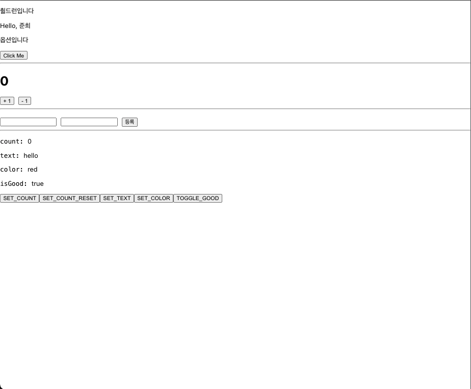
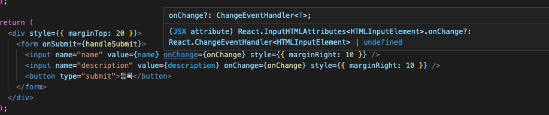
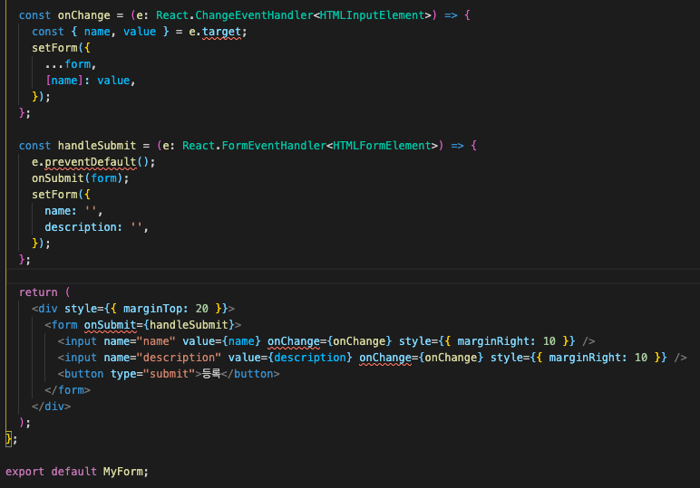
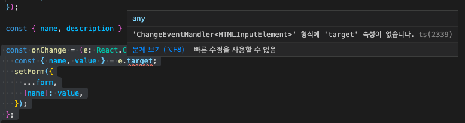
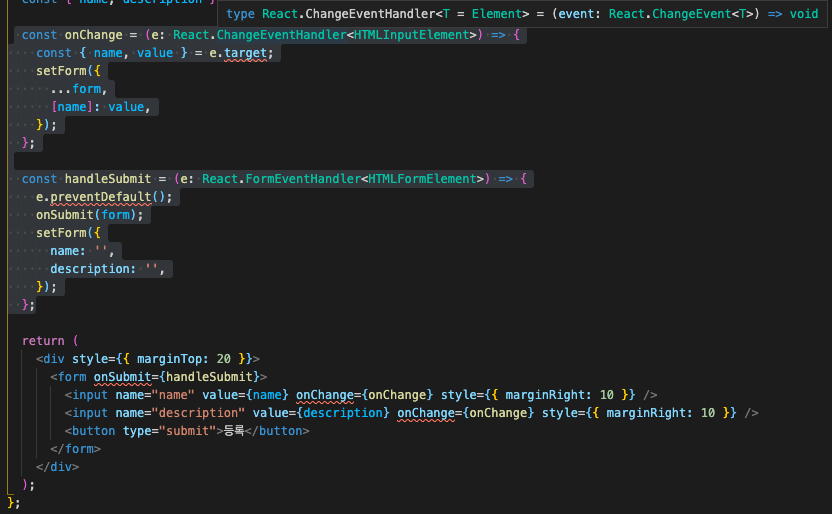
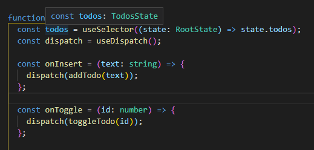

# 📍 리액트에 타입스크립트 적용하기

## 📍 들어가기 앞서

- 현재 저는 많은 프로젝트를 .tsx 즉, 리액트 .jsx 기본 문법에 타입스크립트 문법을 적용한 형태로 진행하고 있습니다.
- 스터디를 진행하면서 만나 느낀 점은, 현업에 계시는 개발자 분들 대부분이 타입스크립트 환경을 더 즐겨 사용하셨고 타입스크립트 공부를 강조하셨습니다.<br/>
- 기존 공부를 하면서 만들어 둔 폴더인 todolist, todo-redux, using-thunk에 대해 복기하며, 실제 프로젝트에서 느낀 어려움과 해결방안에 대해 공부합니다.
- react 프로젝트 작업 시에 함수 선언식과 함수 표현식을 상황에 따라 모두 사용하게 되는데, 이때 전달되는 props 와 타입 적용 시에 느꼈던 벽을 허물고 깊게 공부할 예정입니다.

## 목차

- [todolist](#-todolist)
- [todo-redux](#-todo-redux)
- [redux-thunk](#-redux-thunk)

## 📍 todolist

```tsx

📁 src/App.tsx
...

const App: React.FC = () => {
  const onClick = (name: string) => {
    alert(`${name} say hello~`);
  };

  const onSubmit = (form: { name: string; description: string }) => {
    alert(`name : ${form.name} \ndescription : ${form.description}`);
  };
  return (
    <div>
      <Greetings name="준희" optional="옵션입니다" onClick={onClick} />
      <hr />
      <Counter />
      <hr />
      <MyForm onSubmit={onSubmit} />
      <hr />
      <SampleProvider>
        <ReducerSample />
      </SampleProvider>
    </div>
  );
};

export default App;
```

> 실제 자료는 📁 ReactByTs/todolist에 들어있습니다.

- 함수 표현식을 사용하여 App 컴포넌트가 작성되었습니다.
- React.FC (Functional Component) 라는 뜻으로 함수 선언식 또는 함수 표현식으로 타이핑할 경우 해당 컴포넌트의 타입을 작성해줘야 합니다.
- onClick() 함수와 onSubmit() 함수를 props로 하여금 하위 컴포넌트인 `<Greetings onClick={onClick}>`와 `<MyForm onSubmit={onSubmit}>` 에 전달해주고 있습니다.
- Greetings 컴포넌트 먼저 보겠습니다.

> `<Greetings 전달할 프로퍼티 = {실제 함수}>` 의 형태입니다.

## 📍 1.1) Greetings.tsx

### 📍 화살표 함수를 통해 React.FC를 사용하지 않는 경우

```tsx

📁 src/Greetings.tsx
...

// props로 전달받은 프로퍼티들에 대한 타입을 지정해주었다.
type GreetingsProps = {
  name: string;
  optional?: string;
  onClick: (name: string) => void;
};


const Greetings = ({ name, optional, onClick }: GreetingsProps) => {
  /*
  상위 컴포넌트에 전달받은 프로퍼티들에게 타입 명시를 해줘야 하는데, 이를 타입 GreetingsProps를 만들어 명시해주었습니다.
  useState로 관리되는 state 값이거나, 함수(onClick)의 경우는 받아온 프로퍼티 그대로 사용할 수 없습니다.
  따라서 여기서는 handleClick() 이라는 함수를 만들어 전달받은 onClick 함수를 호출하도록 하였습니다.
   */
  const handleClick = () => {
    onClick(name);
  };
  return (
    <div>
      Hello, {name}
      {optional && <p> {optional}</p>}
      <div>
        <button onClick={handleClick}>Click Me</button>
      </div>
    </div>
  );
};

export default Greetings;

/*
<div>
    <button onClick={onClick(name)}>Click Me</button> 과 같은 형식으로 사용할 수 없습니다.
</div>
*/
```

### 📍 화살표 함수를 통해 React.FC를 사용하는 경우

```tsx

📁 src/Greetings.tsx
...
type GreetingsProps = {
  name: string;
  optional?: string;
  onClick: (name: string) => void;
};

const Greetings: React.FC<GreetingsProps> = ({ name, optional, onClick }) => {
  const handleClick = () => {
    onClick(name);
  };
  return (
    <div>
      Hello, {name}
      {optional && <p> {optional}</p>}
      <div>
        <button onClick={handleClick}>Click Me</button>
      </div>
    </div>
  );
};

export default Greetings;
```

<p><b>: React.FC</b> 를 사용할 때는 props의 타입을 Generics로 넣어서 사용합니다.</p>
<p>첫 번째는, props에 기본적으로 <b>children</b>이 들어가 있다는 것입니다.</p>
<p>children 이 옵셔널 형태로 들어가있다보니까 어찌 보면 컴포넌트의 props 의 타입이 명백하지 않습니다. 예를 들어 어떤 컴포넌트는 children이 무조건 있어야 하는 경우도 있을 것이고, 어떤 컴포넌트는 children 이 들어가면 안되는 경우도 있을 것입니다.</p>

### +) 📍 화살표 함수를 통해 React.FC를 사용하는 경우 (children 사용하기)

```tsx
case 1: 기존코드
<Greetings name="준희" optional="옵션입니다" onClick={onClick}/>

case 2: children 형식을 통해 하위 컴포넌트에 전달하는 경우
<Greetings name="준희" optional="옵션입니다" onClick={onClick}>
  췰드런입니다
</Greetings>
```

<p>React:FC 를 사용하게 되면, props로 전달받은 children 프로퍼티에 대해 타입 설정을 하지 않고 사용할 수 있습니다. </p>

```tsx
type GreetingsProps = {
  name: string;
  optional?: string;
  onClick: (name: string) => void;
};

const Greetings: React.FC<GreetingsProps> = ({
  children,
  name,
  onClick,
  optional,
}) => {
  const handleClick = () => {
    onClick(name);
  };

  //<Greetings>...</Greetings> 사이에 넘겨준 값을 children 으로 활용하여 자식 컴포넌트에서 사용할 수 있습니다.

  return (
    <div>
      <p>{children}</p>
      {/* 전달 받은 children props를 {children} 을 통해 사용하였습니다. */}
      Hello, {name}
      {optional && <p> {optional}</p>}
      <div>
        <button onClick={handleClick}>Click Me</button>
      </div>
    </div>
  );
};

export default Greetings;
```



### 📍 function 키워드를 통해 작성하는 경우

```tsx
type GreetingsProps = {
  name: string;
  optional?: string;
  onClick: (name: string) => void;
};

function Greetings({ name, optional, onClick }: GreetingsProps) {
  return (
    <div>
      Hello, {name}
      {optional && <p> {optional}</p>}
      <div>
        <button onClick={handleClick}>Click Me</button>
      </div>
    </div>
  );
}

export default Greetings;
```

### 📍 +) function 키워드를 통해 작성하는 경우 (props로 전달 후에 구조분해 할당 하는 방법)

> 팀원 분이 쓰시는 방법을 추가해 보았습니다. 개인적으로는 이 방법이 제일 편한듯 합니다.<br/>
> 원하는 props {name, optional, onClick } 만 뽑아서 사용할 수 있기 때문입니다.

```tsx
import React from "react";

type GreetingsProps = {
  name: string;
  optional?: string;
  onClick: (name: string) => void;
};

function Greetings(props: GreetingsProps) {
  const { name, optional, onClick } = props;

  const handleClick = () => {
    onClick(name);
  };
  return (
    <div>
      Hello, {name}
      {optional && <p> {optional}</p>}
      <div>
        <button onClick={handleClick}>Click Me</button>
      </div>
    </div>
  );
}
```

## 📍 1.2) Counter.tsx

```tsx
import React, { useState } from "react";

function Counter() {
  const [count, setCount] = useState<number>(0);
  const onIncrease = () => setCount(count + 1);
  const onDecrease = () => setCount(count - 1);
  return (
    <div>
      <h1>{count}</h1>
      <div>
        <button onClick={onIncrease}>+1</button>
        <button onClick={onDecrease}>-1</button>
      </div>
    </div>
  );
}

export default Counter;
```

<p>TS 없이 리액트 컴포넌트를 작성하는 것과 별반 차이가 없습니다. <b>useState</b>를 사용할 때, <b>useState&lt;number&gt;()</b>와 같이 제네릭을 사용하여 해당 상태가 어떤 타입을 가지고 있을지 설정만 해주면 됩니다.</p>

<p>사실 제네릭으로 감싸지 않더라도 타입스크립트의 타입 추론에 의해 number인 것을 유추할 수 있습니다. <br/>그렇다면 어떤 상황에 제네릭을 사용하는 게 좋을까요?<Br/>바로, 상태가 null 일 수도 있고 아닐수 도 있을 때 제네릭을 활용하시면 좋습니다.</p>

```tsx
type Information = { name: string; description: string };
const [info, setInfo] = useState<Information | null>(null);

// 초기 값이 null 일 경우, 제네릭을 사용하는 것이 가독성이 좋습니다.
```

## 📍 1.3) MyForm.tsx

```tsx
import React, { useState } from "react";

type MyFormProps = {
  onSubmit: (form: { name: string; description: string }) => void;
};

function MyForm({ onSubmit }: MyFormProps) {
  const [form, setForm] = useState({
    name: "",
    description: "",
  });

  const { name, description } = form;

  const onChange = (e: any) => {
    // e 값을 무엇으로 설정해야할까요?
    // 일단 모를떄는 any 로 설정합니다.
  };

  const handleSubmit = (e: any) => {
    // 여기도 모르니까 any 로 하겠습니다.
  };

  return (
    <form onSubmit={handleSubmit}>
      <input name="name" value={name} onChange={onChange} />
      <input name="description" value={description} onChange={onChange} />
      <button type="submit">등록</button>
    </form>
  );
}

export default MyForm;
```

- MyForm 컴포넌트는 기본적으로 상위 디렉토리인 App에게 props로 onSubmit 함수를 전달받은 상태입니다
- 이를 사용하기 위해서는 자식 컴포넌트에서 또한 해당 함수에 대한 타입을 정의해줘야 합니다.
- 앞서 사용한 것처럼, function 키워드를 사용하여 컴포넌트를 구성할 때, 정의된 타입을 <b>: 타입명</b> 형식으로 넘겨줘야 합니다.

```tsx
type MyFormProps = {
  onSubmit: (form: { name: string; description: string }) => void;
};

function MyForm({ onSubmit }: MyFormProps) {
  ...
}
```

### 📍 MyForm 내부에서 쓰이는 함수에 대한 이벤트 타입 정의하기

- 우리는 MyForm 컴포넌트를 완성시키기 위해 input 태그의 onChange 프로퍼티와 form 태그의 onSubmit 프로퍼티를 사용합니다.
- custom hook을 만들어 useState와 onChange에 대응되는 훅함수를 만들기도 하지만, 간단하게 만들어보도록 하겠습니다.

```tsx
const onChange = (e: any) => {
  // e 값을 무엇으로 설정해야할까요?
  // 일단 모를떄는 any 로 설정합니다.
};

const handleSubmit = (e: any) => {
  // 여기도 모르니까 any 로 하겠습니다.
};
```

- 해당 함수에 event:any 에서 any 보다 정확한 타입을 주기 위해서는 어떻게 해야 할까요?
- 답은 해당 프로퍼티를 클릭하여 보면 알 수 있습니다.



```tsx
(JSX attribute) React.InputHTMLAttributes<HTMLInputElement>.onChange?: React.ChangeEventHandler<HTMLInputElement> | undefined
```

- 에서 onChange? : <b>React.ChangeEventHandler<HTMLInputElement> | undefined </b> 부분이 해당 event에 대한 타입입니다.
- 이를 코드에 적용하면 다음과 같습니다.

```tsx
const onChange = (e: React.ChangeEventHandler<HTMLInputElement>) => {
  const { name, value } = e.target;
  setForm({
    ...form,
    [name]: value,
  });
};

const handleSubmit = (e: React.FormEventHandler<HTMLFormElement>) => {
  e.preventDefault();
  onSubmit(form);
  setForm({
    name: "",
    description: "",
  });
};
```

<p>결과 화면을 보겠습니다</p>



<p> 아직도 에러군요, 왜 그럴까요? 확인해보겠습니다.</p>



> 'ChangeEventHandler<HTMLInputElement>' 형식에 'target' 속성이 없습니다. 라는 오류가 나옵니다.



```tsx
 type React.ChangeEventHandler<T = Element> = (event: React.ChangeEvent<T>) => void
```

<p>현재는 <b>ChangeEventHandler</b>를 통해 표현했는데, event, e 객체를 컨트롤하기 위해서는 <b>ChangeEvent</b>를 사용하라는 것 같습니다. </p>

```tsx
  📁 /src/MyForm.tsx
  ...
  const onChange = (e: React.ChangeEvent<HTMLInputElement>) => {
    const { name, value } = e.target;
    setForm({
      ...form,
      [name]: value,
    });
  };

  const handleSubmit = (e: React.FormEvent<HTMLFormElement>) => {
    e.preventDefault();
    onSubmit(form);
    setForm({
      name: '',
      description: '',
    });
  };

  return (
    <div style={{ marginTop: 20 }}>
      <form onSubmit={handleSubmit}>
        <input name="name" value={name} onChange={onChange} style={{ marginRight: 10 }} />
        <input name="description" value={description} onChange={onChange} style={{ marginRight: 10 }} />
        <button type="submit">등록</button>
      </form>
    </div>
  );
};

export default MyForm;

```

<p>매우 까다로운 과정일 수 있지만 이 흐름을 이해한다면, 상태관리 전까지 리액트에 타입스크립트를 적용하는 것은 문제가 없을 것입니다!</p>

## 📍 todo redux

타입스크립트에서 리덕스 프로처럼 사용하기 !

- <a href="https://github.com/erikras/ducks-modular-redux">Ducks 패턴</a>을 사용하여 todolist에 리덕스 형식을 적용합니다
- 즉, 액션타입, 액션생성함수, 리듀서를 모두 한 파일에 작성하겠다는 의미입니다
- 기본적인 TodoApp의 틀은 다음과 같습니다.

```tsx
import React from "react";
import { useSelector, useDispatch } from "react-redux";
import { RootState } from "../modules";
import { toggleTodo, removeTodo, addTodo } from "../modules/todos";
import TodoInsert from "../components/TodoInsert";
import TodoList from "../components/TodoList";

function TodoApp() {
  const todos = useSelector((state: RootState) => state.todos);
  const dispatch = useDispatch();

  const onInsert = (text: string) => {
    dispatch(addTodo(text));
  };

  const onToggle = (id: number) => {
    dispatch(toggleTodo(id));
  };

  const onRemove = (id: number) => {
    dispatch(removeTodo(id));
  };

  return (
    <>
      <TodoInsert onInsert={onInsert} />
      <TodoList todos={todos} onToggle={onToggle} onRemove={onRemove} />
    </>
  );
}

export default TodoApp;
```

- react-redux의 useDispatch와 useSelector를 사용하여 상태관리 및 액션을 실행합니다.
- useSelector로 관리되는 todos 는 RootState 를 통해 합쳐진 todos 모듈입니다.
- (state: RootState)에서 타입을 지정해준 RootState는 modules/index 에서 export 하였습니다.
- 함수별 파라미터에는 해당 타입을 선언해주었고 props로 함수를 넘겨주었습니다.

> 우선 RootState관리하는 모듈인 todos 모듈부터 보겠습니다.

```tsx
// 액션 타입 선언
// 뒤에 as const 를 붙여줌으로써 나중에 액션 객체를 만들게 action.type 의 값을 추론하는 과정에서
// action.type 이 string 으로 추론되지 않고 'todos/ADD_TODO' 와 같이 실제 문자열 값으로 추론 되도록 해줍니다.
const ADD_TODO = "todos/ADD_TODO" as const;
const TOGGLE_TODO = "todos/TOGGLE_TODO" as const;
const REMOVE_TODO = "todos/REMOVE_TODO" as const;

let nextId = 4; // 새로운 항목을 추가 할 때 사용 할 고유 ID 값

// 액션 생성 함수를 생성합니다
export const addTodo = (text: string) => ({
  type: ADD_TODO, // action.type 의 값을 추론하는 과정
  payload: {
    id: nextId++,
    text,
  },
});

// 액션에 부가적으로 필요한 값을 payload 라는 이름으로 통일합니다
// 이는 FSA (https://github.com/redux-utilities/flux-standard-action) 라는 규칙인데
// 이 규칙을 적용하면 액션들이 모두 비슷한 구조로 이루어져있게 되어 추후 다룰 때도 편하고
// 읽기 쉽고, 액션 구조를 일반화함으로써 액션에 관련돤 라이브러리를 사용 할 수 있게 해줍니다.
// 다만, 무조건 꼭 따를 필요는 없습니다.

export const toggleTodo = (id: number) => ({
  type: TOGGLE_TODO,
  payload: id,
});

export const removeTodo = (id: number) => ({
  type: REMOVE_TODO,
  payload: id,
});

// 모든 액션 객체들에 대한 타입 준비
// ReturnType<typeof _____> 는 특정 함수의 반환값을 추론해줍니다
// 상단부에서 액션타입을 선언 할 떄 as const 를 하지 않으면 이 부분이 제대로 작동하지 않습니다.
type TodosAction =
  | ReturnType<typeof addTodo>
  | ReturnType<typeof toggleTodo>
  | ReturnType<typeof removeTodo>;

// 상태에서 사용 할 할 일 항목 데이터 타입 정의
export type Todo = {
  id: number;
  text: string;
  done: boolean;
};

// 이 모듈에서 관리할 상태는 Todo 객체로 이루어진 배열
// 관리해야 하는 상태가 배열이기 때문에 Todo 배열에 대한 타입을 지정하는 과정을 한번 더 거쳤습니다.
export type TodosState = Todo[];

// 초기 상태 선언
const initialState: TodosState = [
  {
    id: 1,
    text: "냥냥펀치",
    done: false,
  },
  {
    id: 2,
    text: "원투펀치",
    done: false,
  },
  {
    id: 3,
    text: "쓰리포펀치",
    done: false,
  },
];

// 리듀서 작성
export default function todos(
  state: TodosState = initialState,
  action: TodosAction // 여기서 ReturnType<typeof ...> 로 선언했던 타입을 사용합니다.
) {
  switch (action.type) {
    case ADD_TODO:
      return state.concat({
        id: action.payload.id,
        text: action.payload.text,
        done: false,
      });
    case TOGGLE_TODO:
      return state.map((todo) =>
        todo.id === action.payload ? { ...todo, done: !todo.done } : todo
      );
    case REMOVE_TODO:
      // payload 가 number 인 것이 유추됩니다.
      return state.filter((todo) => todo.id !== action.payload);
    default:
      return state;
  }
}
```

- 주의 깊게 봐야 할 부분은 관리해야 할 값이 배열일 경우 해당 배열에 대한 타입을 위에서 한 번 더 선언해준다는 것입니다
- 이해를 돕기 위해 state 가 number인 상태 값의 코드를 보여드리겠습니다.

```tsx

🐕 initialState 의 타입이 하나일 때

type CounterState = {
  count: number;
};

const initialState: CounterState = {
  count: 0,
};
```

- 위처럼 initialState 일반적인 number, string, boolean 값이라면 해당 타입을 한 번 더 지정해줄 필요가 없습니다.
- 하지만 타입이 배열 객체라면 그에 대한 타입을 먼저 선언해주어야 합니다.

```tsx
🐈 initialState 의 타입이 배열 객체일 때

export type Todo = {
  id: number;
  text: string;
  done: boolean;
};

export type TodosState = Todo[];

const initialState: TodosState = [
  {
    id: 1,
    text: "냥냥펀치",
    done: false,
  },
  {
    id: 2,
    text: "원투펀치",
    done: false,
  },
  {
    id: 3,
    text: "쓰리포펀치",
    done: false,
  },
];

// 프로퍼티인 id, text, done 에 대한 타입을 먼저 선언해줍니다.
```

- 이제 위에서 만든 todos 모듈을 rootReducer에 보냅니다
- 하나의 스토어`(=store)`만 가진다는 규칙에 따라, 리듀서가 많아질 경우 이렇게 combine 시켜서 사용합니다

```tsx
import { combineReducers } from "redux";
import todos from "./todos";
const rootReducer = combineReducers({
  todos,
});

// 루트 리듀서를 내보내주세요.
export default rootReducer;

// 루트 리듀서의 반환값를 유추해줍니다
// 추후 이 타입을 컨테이너 컴포넌트에서 불러와서 사용해야 하므로 내보내줍니다.
export type RootState = ReturnType<typeof rootReducer>;
```

- 다시 TodoApp으로 들어와 현재 todos의 타입을 확인해봅시다



- 타입 추론에 의해 todos가 자동으로 <b>const todos: TodosState</b> 형태를 띄는 것을 알 수 있습니다
- 하위 컴포넌트인 &lt;TodoInsert&gt; , &lt;TodoList&gt; 의 경우 props로 함수를 전달하는 것 외에는 기존 방식과 같습니다
- 따라서 해당 함수(onInsert, onToggle, onRemove)가 실행 됐을 때, dispatch 가 발생하며 요청된 액션에 따라 state의 값이 변화한다는 흐름을 캐치하면 충분합니다
- reducer에서 concat을 통해 state의 값이 변경된다면, virtual DOM이 이를 감지하고 변화된 state를 렌더링해줄 것입니다
- 그렇다면 우리는 그 변화를 눈으로 찾아볼 수 있을 것입니다

## 📍 redux thunk

> 리덕스 미들웨어를 다루는 방법을 잘 모르신다면 <a href="https://react.vlpt.us/redux-middleware/">리덕스 미들웨어 튜토리얼</a>을 먼저 읽어주세요

<p>간단하게 말하자면 리덕스 미들웨어를 사용하면 액션이 디스패치 된 다음, 리듀서에서 해당 액션을 받아와서 업데이트하기 전에 추가적인 작업을 할 수 있습니다.</p>

- 특정 조건에 따라 액션이 무시되게 만들 수 있습니다
- 액션을 콘솔에 출력하거나, 서버쪽에 로깅을 할 수 있습니다
- 액션이 디스패치 됐을 때 이를 수정해서 리듀서에게 전달되도록 할 수 있습니다
- 특정 액션이 발생했을 때 이에 기반하여 다른 액션이 발생되도록 할 수 있습니다
- 특정 액션이 발생했을 때 특정 자바스크립트 함수를 실행시킬 수 있습니다
