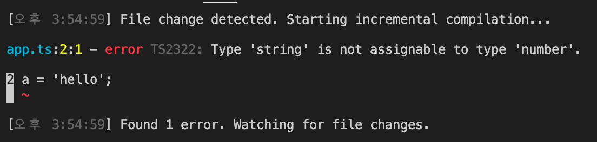
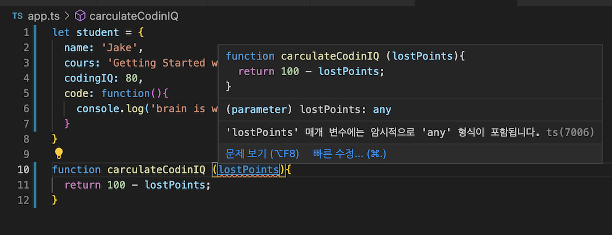

## 사용한 extension

- prettier
- eslint
- path intellisense
- bracket pair colorizer

## 특징

타입스크립트는 js를 기반으로 한 언어이기 때문에 자바스크립트에서 유효한 코드는 타입스크립트에서도 유효하다

> .ts로 작성하더라도 js 코드가 틀리지 않다면 실행에 문제가 없다.

## 사용법

1. .ts 로 작성한 파일을 터미널에

```
tsc app.ts
```

와 같은 형태로 입력

2. 변환된 app.js 파일 생성

3. 기존 app.ts 에서 오류 해결하기

```
tsc --init
```

명령어를 통해 tsconfig.json 파일을 생성

### ts 파일 업데이트

1. app.ts 파일을 변경할 경우, app.js에서도 업데이트 된 형태로 바꾸고 싶을 때

```js
tsc -w; // -w 는 watch의 의미

또는

tsc -w app.ts // 해당 파일
```

2. 해당 명령어를 사용하면 터미널을 종료하지 않는 동안에는 변경된 .ts 파일을 자동으로 .js로 컴파일해준다.

<hr/>

## 타입 추론(Type Inference)

```js
let a = 5;
```

a = 5라고 지정한 해당 변수의 타입을 string으로 바꿔보려고 한다.<br/>

```js
let a = 5;
a = '타입스크립트';
```

<br/>

다음과 같은 오류가 발생한다. <br/>

 <br/>

ts는 변수 값이 기존 숫자타입(5)에서 다른 타입인 문자열('타입스크립트')로 바꿀 수 없기 때문에 변수를 재할당할 수 없다는 의미이다. <br/>
ts의 특징인 <b>타입 추론</b>에 의해 변수 a의 타입은 자동으로 number 타입으로 지정된 것이다.<br/>
또한 타입스크립트는 기존의 코드를 바탕으로 넘겨받는 파라미터의 타입을 자동으로 추론해주는 기능을 가지고 있다.<br/>

 <br/>

```ts
// 해당 코드를 ts로 바꾼 형태

let student = {
  name: 'Jake',
  cours: 'Getting Started with TypeScript',
  codingIQ: 80,
  code: function () {
    console.log('brain is working hard');
  },
};

function carculateCodinIQ(lostPoints: any) {
  return 100 - lostPoints;
}

/*
lostPoints는 return 되는 100 - lostPoints에 의해 자동적으로 number 타입이라는 것이 추론 가능하다.
*/
```

<hr/>

## 타입 명시

<p>타입 명시란 변수를 선언할 때, 변수 값의 타입을 명시함으로써 변수 값의 데이터 타입을 지정하는 것을 의미합니다. 또한 ts에서는 function 함수를 통해 return 되는 반환 값에도 타입을 지정해 줄 수 있습니다.</p>

```ts
let studentID: number = 12345;
let studentName: string = 'Jenny Kim';
let age: number = 21;
let gender: string = 'female';
let subject: string = 'JavaScript';
let courseCompleted: boolean = false;

function getStudentDetails(studentID: number): any {
  return;
}
```

<p>우리가 만든 getStudentDetails()함수가 반환 값으로 오브젝트타입을 받기 위해서는 해당 프로퍼티를 일일히 나열하여 적어줄 수 있습니다.</p>

```ts
function getStudentDetails(
  studentID: number
): {
  studentID: number;
  studentName: string;
  age: number;
  gender: string;
  subject: string;
  courseCompleted: boolean;
} {
  return null;
}
```

<hr/>

## 인터페이스로 객체 구조 정의하기

복잡해보이는 위의 구조를 인터페이스를 사용하여 분리해봅니다.

```ts
...
interface Student {
  studentID: number;
  studentName: string;
  age: number;
  gender: string;
  subject: string;
  courseCompleted: boolean;
}
// 인터페이스를 통해 복잡해질 수 있는 코드의 반환타입을 위에서 선언하고, Student 키워드만 가져와 사용한다

function getStudentDetails(studentID: number):Student
{
  return {
    studentID: 12345,
    studentName: 'Jenny Kim',
    age: 21,
    gender: 'female',
    subject: 'JavaScript',
    courseCompleted: true
  };
  // 위 코드에 리턴될 때는 인터페이스의 구조에 들어있는 프로퍼티들을 모두 가져야 한다.
}

```

<p>추가적으로, 인터페이스 타입으로 가지는 값은 인터페이스의 구조를 그 값으로 가지도록 강제됩니다. 리턴되는 프로퍼티가 인터페이스에 존재하는 프로퍼티의 수와 다를 시에는 오류가 발생합니다.</p>

> 반환값에 포함되어야만 한다는 오류

<p>만일 인터페이스의 특정 프로퍼티를 리턴문에서 사용하지 않기 위해서는 프로퍼티 키에 ? 를 붙여줘야 한다.</p>

```ts
...
interface Student {
  studentID: number;
  studentName: string;
  age?: number;     // age에 (?)를 붙임으로 return 시에 age를 생략해도 코드에 문제가 발생하지 않는다.
  gender: string;
  subject: string;
  courseCompleted: boolean;
}

function getStudentDetails(studentID: number):Student
{
  return {
    studentID: 12345,
    studentName: 'Jenny Kim',
    gender: 'female',
    subject: 'JavaScript',
    courseCompleted: true
  };
}
```

### ts 코드의 재사용

### Read Only 속성

<p>Readonly가 붙은 인터페이스의 프로퍼티는 읽기전용 프로퍼티로 객체가 생성될 때 할당된 프로퍼티 값은 그 후에 바꿀 수 없다. </p>

```ts
interface Student {
  readonly studentID: number;   // readonly 추가
  studentName: string;
  age?: number;
  gender: string;
  subject: string;
  courseCompleted: boolean;
  // addComment? (comment: string): string;
  addComment?: (comment: string) => string;
}

...

function saveStudentDetails(student: Student): void{
  student.studentID = 12131414; // readonly로 작성했기 때문에 studentID 의 값을 바꿀 수 없다는 오류 출력
}
>>>
Cannot assign to 'studentID' because it is a read-only property.

```

<p>인터페이스는 실제로 JS 코드로 변환될 때, 변환되어 .js 파일로 넘어가지 않는다. 타입스크립트 컴파일러가 인터페이스를 코드에서 지우기 때문이다. 즉, 인터페이스는 작성 중인 코드에 대한 더 많은 정보를 타입스크립트에게 제공하기 위해 존재한다는 것을 알아두어야 한다. </p>
<p>타입스크립트에게 더 많은 정보를 제공할 수 록 컴파일 시에 우리가 만드는 오류를 더 많이 잡아줄 수 있기 때문이다.</p>
