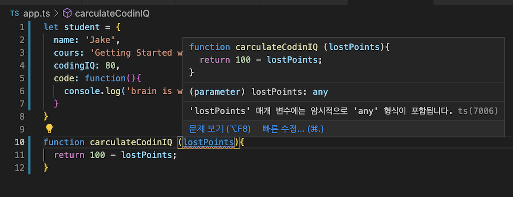
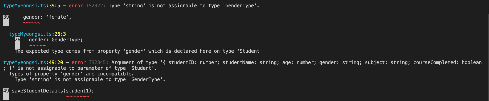
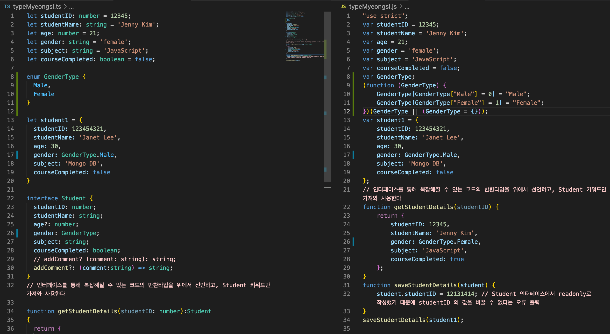
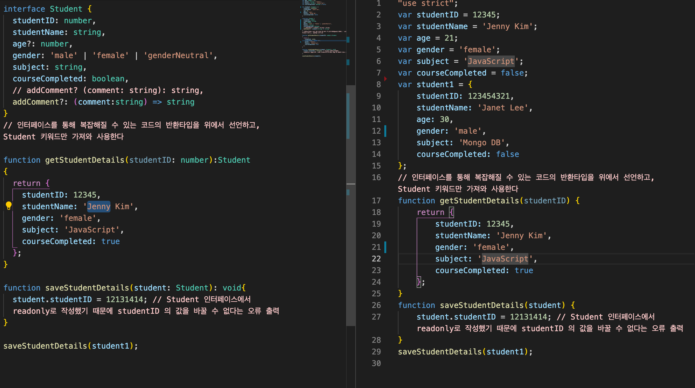
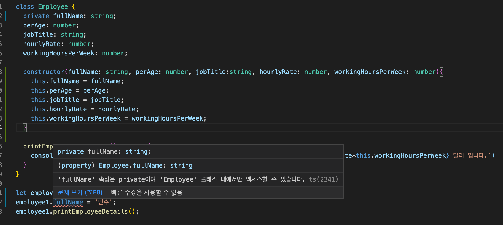
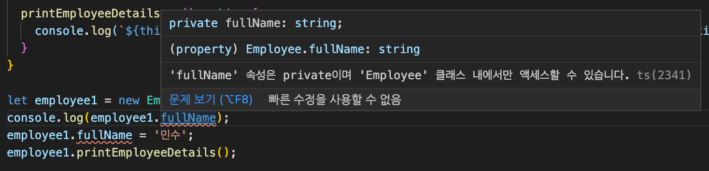
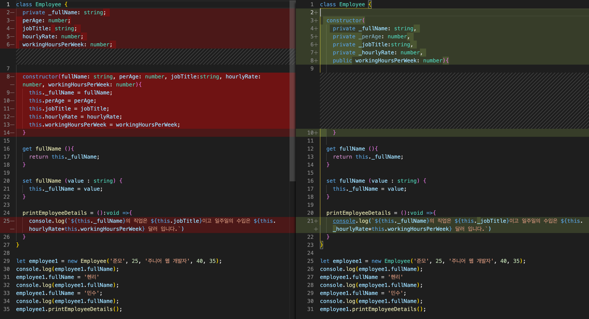

## 👉🏼 Next is ....

<a href="./ReactByTS/readme.md">리액트에 타입스크립트 한 방울 넣기</a>

## 👉🏼 참고자료

이 글을 '땅콩코딩'님의 타입스크립트 강의를 바탕으로 작성된 글입니다.<br/>

> 참고자료 : <a href="https://www.youtube.com/channel/UCQrIKpEc3FFO1KJ5zkoIcYA">타입스크립트 강의 바로가기</a><br/>
> 참고자료 : <a href="https://ahnheejong.gitbook.io/ts-for-jsdev/">자바스크립트 개발자를 위한 타입스크립트</a></br>
> 참고자료 : <a href="https://typescript-kr.github.io/">타입스크립트 핸드북</a></br>
> 참고자료 : <a href="https://react.vlpt.us/using-typescript/">벨로퍼트님의 리액트 + 타입스크립트</a></br>

## 👉🏼 목차

- [특징](#-특징)
- [사용법](#-사용법)
- [타입 추론](#-타입-추론)
- [타입 명시](#-타입-명시)
- [인터페이스로 객체 구조 정의하기](#-인터페이스로-객체-구조-정의하기)
- [열거형과 리터럴 타입](#-열거형과-리터럴-타입)
- [Any Union Type Type Aliases Type Guards](#-Any-Union-Type-Type-Aliases-Type-Guards)
- [함수 타이핑 선택적 매개 변수와 기본 매개 변수](#-함수-타이핑-선택적-매개-변수와-기본-매개-변수)
- [객체 지향 프로그래밍 클래스와 오브젝트 관계 파헤치기](#-객체-지향-프로그래밍-클래스와-오브젝트-관계-파헤치기)

## 👉🏼 사용한 extension

- prettier
- eslint
- path intellisense
- bracket pair colorizer

## 👉🏼 특징

타입스크립트는 js를 기반으로 한 언어이기 때문에 자바스크립트에서 유효한 코드는 타입스크립트에서도 유효하다

> .ts로 작성하더라도 js 코드가 틀리지 않다면 실행에 문제가 없다.

## 👉🏼 사용법

1. .ts 로 작성한 파일을 터미널에

```
tsc app.ts
```

와 같은 형태로 입력

2. 변환된 app.js 파일 생성

3. 기존 app.ts 에서 오류 해결하기

```
tsc --init
```

명령어를 통해 tsconfig.json 파일을 생성

### ts 파일 업데이트

1. app.ts 파일을 변경할 경우, app.js에서도 업데이트 된 형태로 바꾸고 싶을 때

```js
tsc -w; // -w 는 watch의 의미, 전역으로 .ts 파일을 감지하여 .js 형식으로 변환

또는

tsc -w app.ts // 해당 파일
```

2. 해당 명령어를 사용하면 터미널을 종료하지 않는 동안에는 변경된 .ts 파일을 자동으로 .js로 컴파일해준다.

<hr/>

## 👉🏼 타입 추론

> (Type Inference)

```js
let a = 5;
```

a = 5라고 지정한 해당 변수의 타입을 string으로 바꿔보려고 한다.<br/>

```js
let a = 5;
a = "타입스크립트";
```

<br/>

다음과 같은 오류가 발생한다. <br/>

 <br/>

> 'string' 타입은 'number' 타입에 할당할 수 없다<br/>
> 현재 a 에는 명시되지는 않았지만, 타입스크립트의 타입 추론 특징에 의해 5 라는 'number' 타입이 들어있다.<br/>
> 따라서 해당 값에 "타입스크립트" 라는 'string' 타입의 문자열을 재할당(assign)할 수 없다는 오류가 나온다.

 <br/>

> 함수 사용시에 함수가 파라미터를 받아 결과를 리턴해주는 함수라면 반드시 타입을 적어줘야 합니다.<br/>
> any를 통해 임시로 warning을 제거할 수는 있지만, any 타입을 사용하면 타입스크립트를 사용하는 이유가 없겠죠?

```ts
// 해당 코드를 ts로 바꾼 형태

let student = {
  name: "Jake",
  cours: "Getting Started with TypeScript",
  codingIQ: 80,
  code: function () {
    console.log("brain is working hard");
  },
};

function carculateCodinIQ(lostPoints: number) {
  return 100 - lostPoints;
}

/*
lostPoints는 return 되는 100 - lostPoints에 의해 자동적으로 number 타입이라는 것이 추론 가능하다.
*/
```

<hr/>

## 👉🏼 타입 명시

> 1. 변수 선언 시에 해당 변수에 대한 타입 명시<br/>
> 2. 함수 선언시에 파라미터가 있을 시, 파라미터에 대한 타입 명시<br/>
> 3. 파라미터가 있을 시, 리턴 값에 대한 타입 명시<br/>

<p>타입 명시란 변수를 선언할 때, 변수 값의 타입을 명시함으로써 변수 값의 데이터 타입을 지정하는 것을 의미합니다. 또한 ts에서는 function 함수를 통해 return 되는 <b>반환 값에도 타입을 지정해 줄 수 있습니다</b>.</p>

```ts
case 1 : 변수 선언 시에 해당 변수에 대한 타입 명시

let studentID: number = 12345;
let studentName: string = "Jenny Kim";
let age: number = 21;
let gender: string = "female";
let subject: string = "JavaScript";
let courseCompleted: boolean = false;

function getStudentDetails(studentID: number): any {
  return;
}

// 매개변수 studentId 에는 'number' 를,
// return 될 값에 any라는 타입을 지정해주었다.
```

<p>우리가 만든 <b>getStudentDetails( )</b> 함수가 반환 값으로 <b>오브젝트타입</b>을 받기 위해서는 해당 프로퍼티를 일일히 나열하여 적어줄 수 있습니다.</p>

```ts
case 2: 함수 선언시에 파라미터가 있을 시, 파라미터에 대한 타입 명시

function getStudentDetails(
  studentID: number
): {
  studentID: number; // 인터페이스나 타입을 통해 사전에 function 함수를 통해 return 받을 반환값을 적어주지 않는 경우
  studentName: string; // { } 중괄호 안에 리턴받을 값을 명시해줘야 합니다.
  age: number;
  gender: string;
  subject: string;
  courseCompleted: boolean;
} {
  return null;
}
```

> 하지만, 이렇게 반환 값에 대해 일일히 { } 객체형식으로 나열한다면 코드의 재사용성과 가독성이 모두 떨어질 것입니다.<br/>
> 이를 해결하기 위해 우리는 '인터페이스' 또는 '타입'을 통해 객체 구조를 미리 정의합니다

<hr/>

## 👉🏼 인터페이스로 객체 구조 정의하기

<p>
인터페이스는 어떨 때 사용할까요? 위의 코드는 상관없지만, 타입스크립트는 <b>반환값에 대한 타입정의</b>와 <b>파라미터에 대한 타입 정의</b>를 요구합니다.
반환 값에 객체 형식으로 많을 수도 있고 다양한 상황에 대비하기 위해서 인터페이스를 만들어 반환될(return 될) 프로퍼티와 해당 타입을 정의해둡니다.
함수를 반환할 때 해당 반환값에 대한 프로퍼티와 타입을 계속 지정하지 않더라도, 인터페이스만 불러와서 사용할 수 있겠죠? 이처럼 코드의 재사용성을 높이기 위해서
우리는 인터페이스를 사용합니다. <br/>
<br/>
복잡해 보이는 위의 구조를 인터페이스를 사용하여 분리해봅시다.
</p>

```ts
...
interface Student {
  studentID: number;
  studentName: string;
  age: number;
  gender: string;
  subject: string;
  courseCompleted: boolean;
}
// 인터페이스를 통해 복잡해질 수 있는 코드의 반환타입을 위에서 선언하고, Student 키워드만 가져와 사용한다

function getStudentDetails(studentID: number):Student
// 리턴값에 대해 기존 객체 형식 { ... }을 사용하지 않고, 인터페이스를 불러와 사용할 수 있습니다.
{
  return {
    studentID: 12345,
    studentName: 'Jenny Kim',
    age: 21,
    gender: 'female',
    subject: 'JavaScript',
    courseCompleted: true
  };
  // 위 코드에 리턴될 때는 인터페이스의 구조에 들어있는 프로퍼티들을 모두 가져야 한다.
}

```

<p>추가적으로, 인터페이스 타입으로 가지는 값은 인터페이스의 구조를 그 값으로 가지도록 강제됩니다. 리턴되는 프로퍼티가 인터페이스에 존재하는 프로퍼티의 수와 다를 시에는 오류가 발생합니다.</p>

> 반환값에 포함되어야만 한다는 오류

<p>만일 인터페이스의 특정 프로퍼티를 리턴문에서 사용하지 않기 위해서는 프로퍼티{ key: value } 키에 <b>'?'</b> 를 붙여줘야 한다.</p>

```ts
...
interface Student {
  studentID: number;
  studentName: string;
  age?: number;     // age에 (?)를 붙임으로 return 시에 age를 생략해도 코드에 문제가 발생하지 않는다.
  gender: string;
  subject: string;
  courseCompleted: boolean;
  // 하지만 '?'를 사용할 시, 선택적 매개변수로 채택한 매개변수(age)가 중간에 위치한다면 그 뒤에 있는 매개변수들까지 모두 선택적 매개변수로 인식되게 됩니다.
  // 따라서 인터페이스 또는 타입에서 선택적 매개변수를 사용한다면, 가장 마지막에 위치시켜야 합니다.
}

function getStudentDetails(studentID: number):Student
{
  return {
    studentID: 12345,
    studentName: 'Jenny Kim',
    gender: 'female',
    subject: 'JavaScript',
    courseCompleted: true
  };
}
```

### ts 코드의 재사용

### Read Only 속성

<p><b>readonly</b>가 붙은 인터페이스의 프로퍼티는 읽기전용 프로퍼티로 객체가 생성될 때 할당된 프로퍼티 값은 그 후에 바꿀 수 없다. </p>

```ts
interface Student {
  readonly studentID: number;   // readonly 추가
  studentName: string;
  age?: number;
  gender: string;
  subject: string;
  courseCompleted: boolean;
  // addComment? (comment: string): string;
  addComment?: (comment: string) => string;
}

...

function saveStudentDetails(student: Student): void{
  student.studentID = 12131414; // readonly로 작성했기 때문에 studentID 의 값을 바꿀 수 없다는 오류 출력
}
>>>
Cannot assign to 'studentID' because it is a read-only property.

```

<p>인터페이스는 실제로 JS 코드로 변환될 때, .js 파일로 넘어가지 않는다. 타입스크립트 컴파일러가 인터페이스를 코드에서 지우기 때문이다. </p>
즉, <b>인터페이스는 작성 중인 코드에 대한 더 많은 정보를 타입스크립트에게 제공하기 위해 존재한다는 것을 알아두어야 한다.</b></br>
타입스크립트에게 더 많은 정보를 제공할 수 록 컴파일 시에 우리가 만드는 오류를 더 많이 잡아줄 수 있기 때문이다.</p>

<hr/>

## 👉🏼 열거형과 리터럴 타입

프로퍼티의 값을 단순히 타입으로 지정하는 것이 아닌, 실제 값만 받고 싶을 때 우리는 열거형(enum)과 리터럴 타입을 이용하여 프로퍼티에 지정될 키 값을 미리 정해줄 수 있습니다.<br/>
이렇게 정해진 프로퍼티 키 값으로만 할당을 해줘야 오류가 나지 않고 실행될 수 있습니다.

```ts
interface Student {
  studentID: number;
  studentName: string;
  age?: number;
  gender: string;
  subject: string;
  courseCompleted: boolean;
  // addComment? (comment: string): string;
  addComment?: (comment: string) => string;
}
```

<p>우리가 만든 Student 인터페이스입니다. 만일 gender 프로퍼티의 값을 string 타입 중에서도 male 과 female로만 값을 설정할 수 있도록 하려면 어떻게 해야할까요?</p>
<p>첫 번째로는 열거형 Enum을 사용하는 방법입니다. </p>

### Enum

Enum은 연관된 아이템들을 함께 묶어서 표현할 수 있는 수단이라는 의미를 가집니다.<br/>
Enum을 적용하는 방법은 다음과 같습니다.

```ts
enum GenderType {
  Male,
  Female,
}
// enum 이라는 타입으로 GenderType 키워드를 생성해줍니다.

...

interface Student {
  studentID: number;
  studentName: string;
  age?: number;
  gender: GenderType;   // string에서 GenderType으로 변환
  subject: string;
  courseCompleted: boolean;
  // addComment? (comment: string): string;
  addComment?: (comment: string) => string;
}

// 기존 인터페이스에 gender 프로퍼티의 값을 enum으로 설정한 GenderType으로 타입을 설정해 줍니다.
```

<p>그리고 파일을 변환하면 다음과 같은 오류가 나타납니다.</p>
 <br/>
<p>기존에 우리가 작성한 함수에서 gender 타입으로 지정해줬던 값과 enum을 통해 GenderType 내부에 선언한 값이 다르기 때문입니다.<br/>
그렇기 때문에 함수 내에 사용한 gender 프로퍼티의 값을 재설정해줘야 합니다.</p>

```ts
function getStudentDetails(studentID: number): Student {
  return {
    studentID: 12345,
    studentName: "Jenny Kim",
    gender: GenderType.Female, // 'female'의 string 타입에서 enum을 적용시킨 GenderType의 Female 로 값을 할당해줌
    subject: "JavaScript",
    courseCompleted: true,
  };
}
```

<br/>
성공적으로 enum을 적용해 주었습니다. 이제 컴파일된 js 파일을 확인해 볼까요?<br/>

 <br/>

기존 인터페이스와는 다르게 enum으로 만들어준 GenderType은 js 코드에 작성되는 것을 볼 수 있습니다. <br/>
하지만 우리는 컴파일된 js 코드에서도 0, 1, 2 등으로 인덱스처럼 number 타입으로 해당 프로퍼티 값이 정의되는 것이 아닌 string 타입으로 정의되는 것을 원합니다. <br/>
ts에서는 이러한 성질을 string enum이라는 것을 통해 적용하도록 해줍니다.

### string enum

```ts
enum GenderType {
  Male = "male",
  Female = "female",
}
```

<br/>
간단하게 enum의 GenderType 의 프로퍼티 값에 각각 string 타입의 value를 선언해줍니다.<br/>
이를 통해 js 파일에서도 기존의 number 형식의 인덱스값이 아닌, 문자열 값을 갖게 됩니다.<br/>
이것을 string enum이라고 합니다.

```js
case 1: 이전 코드
(function (GenderType) {
    GenderType[GenderType["Male"] = 0] = "Male";
    GenderType[GenderType["Female"] = 1] = "Female";
})(GenderType || (GenderType = {}));

...

case 2: 바뀐 코드
var GenderType;
(function (GenderType) {
    GenderType["Male"] = "male";
    GenderType["Female"] = "female";
})(GenderType || (GenderType = {}));
```

### 리터럴 타입

enum을 사용하는 것과 같은 결과물을 출력하지만 훨씬 더 간편한 선언 방법을 알아보겠습니다.

> gender: "male" | "female" | "genderNeutral" ...

```ts
interface Student {
  studentID: number;
  studentName: string;
  age?: number;
  gender: "male" | "female" | "genderNeutral";
  subject: string;
  courseCompleted: boolean;
  // addComment? (comment: string): string;
  addComment?: (comment: string) => string;
}
```

<br/>
gender 프로퍼티에 enum에서 사용한 것과 같이 genderType.xxx 로 접근하는 것이 아닌, `|` 를 사용하여 값을 직접 적어주는 방식입니다.<br/>

```ts
function getStudentDetails(studentID: number): Student {
  return {
    studentID: 12345,
    studentName: "Jenny Kim",
    gender: "female",
    subject: "JavaScript",
    courseCompleted: true,
  };
}
```

<br/>
코드에서도 gender에서 리터럴한 string 값을 선택해서 적어주면 됩니다.<br/>

 <br/>

하지만, 리터럴로 적용한다면, js로 컴파일 될 때 enum 처럼 타입이 표시되지는 않는다는 점을 알아둬야 합니다.

<hr/>

## 👉🏼 Any Union Type Type Aliases Type Guards

### any

any 타입은 어떤 타입을 적어도 값을 할당할 수 있는 타입입니다.<br/>

```ts
let someValue: any = 5;
someValue = "hello";
someValue = true;
```

<br/>
이와 같이 someValue 변수에 타입을 any로 준다면, 기존 number > string > boolean 으로 타입변환이 자유롭게 가능해집니다.<br/>
하지만, ts에서 효과적인 유지와 보수를 위해서는 타입에 관한 더많은 정보를 명시할 수록 더 좋겠죠?<br/>

### union

만약 작업중인 코드에 타입 명시가 어려운 경우, 그 중에서 제한된 타입만 설정해주기 위해서는 어떻게 해야할까요?<br/>
바로 <b>union 타입</b>이라는 테크닉을 통해 적어줄 수 있습니다. 특별한 기능이 아닌 `|`를 통해 리터럴 형태로 나타내 주는 것입니다. <br/>

```ts
let someValue: number | string = 5;
someValue = 'hello';

someValue = true;  // 타입은 number 와 string으로 제한했으므로 boolean 타입을 쓴다면 에러가 납니다.

>>>
Type 'boolean' is not assignable to type 'string | number'.
```

### Type Aliases

union 타입으로 타입을 지정해주는 것도 좋지만, 코드가 길어질 경우 코드의 재사용성 높이기 위해 <b>Type Aliases</b> 테크닉을 사용합니다.
<br/>

```ts
type StrOrNum = number | string;

let price: StrOrNum = 5;
price = "free";
```

<br/>
string 타입과 number 타입을 유니언타입으로 사용하고 싶을 때, StrOrNum 이라는 Type Aliases를 생성하여 타입자리에 대신 사용할 수 있습니다.

### 타입 가드

```ts
type StrOrNum = number | string;
let itemPrice: number;

const setItemPrice = (price: StrOrNum): void => {
  itemPrice = price;
};

setItemPrice(50);

/*
type.ts:18:3 - error TS2322: Type 'StrOrNum' is not assignable to type 'number'.
  Type 'string' is not assignable to type 'number'.
*/
```

<p>우리는 type aliases를 통해 StrOrNum 이라는 number, string 타입을 사용할 수 있는 타입을 선언해줬습니다. 하지만 함수내부에서 한가지 타입만 받는 경우의 변수가 같이 존재한다면 어떻게 해야 할까요? 위와 같은 상황에서 우리는 타입을 보호할 수 있는 타입 가드를 사용합니다.</p>

```ts
type StrOrNum = number | string;
...

const setItemPrice = (price: StrOrNum):void =>{
  if(typeof price === 'string'){
    itemPrice = 0;
  }else{
  itemPrice = price;
}
}

setItemPrice(50);
```

<p>typeof 연산자를 사용하여 price 값이 number 일 때만 해당 코드가 작동하도록 합니다. 이를 <b>타입 가드</b>라고 합니다.</p>

<hr/>

## 👉🏼 함수 타이핑 선택적 매개 변수와 기본 매개 변수

이번에는 함수에 타입을 정의해주는 것을 배워보도록 하겠습니다. <br/>

```js
// 매개변수를 받는 기본적인 js 문법

function sendGreeting(message, userName) {
  console.log(`${message}, ${userName}`);
}

sendGreeting("Hello", "Mark");
```

<br/>
기본적으로 함수 선언식을 통해 매개변수를 받아 해당 매개변수를 출력하는 구조의 함수를 만들었고, 밑에서 파라미터(매개변수를) 넣어 함수를 호출하는 구조입니다.

### 함수의 타입 명시

타입스크립트에서 함수를 작성하기 위해서는 두 가지 작업이 필요합니다

1. 함수의 반환(return) 타입
2. 함수의 매개변수(parameter) 타입

ts 에서는 이 두 타입을 반드시 명시해주어야 합니다.

### 1. 함수의 반환(return)에 대한 타입 명시

```ts
function 함수이름(매개변수1, 매개변수2): 함수의 반환 타입{
  ...
}
```

<br/>
위의 코드와 같이 <b>함수형 타이핑</b>에서는 매개변수를 표시하는 소괄호 '()' 뒤에 ': 함수의 반환 타입'을 명시해주어야 합니다.

```ts
function sendGreeting(message, userName): void {
  // 반환 값 이 들어갈 { ... } 중괄호 앞이자, 파라미타가 들어있는 (a,b) 소괄호 뒤에 :void라는 반환 타입을 명시했다.
  console.log(`${message}, ${userName}`);
}

sendGreeting("Hello", "Mark");
```

<p>위의 함수와 같이 반환되는(return) 값이 아무 것도 반환하지 않을 경우 :void, 를 통해 아무 것도 반환(return)하지 않는다는 의미합니다.</p>

> <b>void</b> 타입은 함수의 반환 타입으로만 작성할 수 있습니다.

```ts
case 1: string 타입 반환

function sendGreeting(message, userName): string{
  return 'Hello, Mark';
}

/*
다음과 같이 함수에 호출되어 반환되는(return) 값이 string 타입이라면 :string으로 타입을 적어줘야 합니다.
*/
```

```ts
case 2: 배열 타입 반환

function sendGreeting(message, userName): string[]{
  return ['Hello', 'Mark'];

/*
다음과 같이 함수에 호출되어 반환되는(return) 값이 string의 배열 타입이라면 :string[]으로 타입을 적어줘야 합니다.
*/
```

### 2. 함수의 매개변수에 대한 타입 명시

```ts
function sendGreeting(message: string, userName: string): void {
  console.log(`${message}, ${userName}`);
}

sendGreeting("Hello", "Mark");
```

<p>추가적으로 함수의 반환 타입과 더불어 매개변수(파라미터)의 타입 또한 적어주었습니다.</p>

만약 반환 시에 매개변수 하나만 (Hello) 보내준다면 어떻게 될까요?

```ts
function sendGreeting(message : string, userName: string): void{
  console.log(`${message}, ${userName}`)
}

sendGreeting('Hello');  // 함수에서 매개변수를 2개를 받는다고 했지만, 호출 시에 넣어준 매개변수가 한 개인 경우

>>>
/*
  function.ts:1:41
    1 function sendGreeting(message : string, userName: string): void{
    An argument for 'userName' was not provided.
*/
```

<p>이러한 오류 메세지가 나오는 이유는 타입스크립트에서는 함수에 정의된 모든 매개 변수가 함수에 필요하다고 가정하기 때문입니다. </p>

```ts
function sendGreeting(param1, param2): void {}

sendGreeting(arg1, arg2);
```

<p>ts에서는 함수에 정의된 파라미터들과 함수를 호출할 때 보내주는 arguments들을 모두 비교 검사하기 때문에 두 수가 일치해야 합니다. 만일 매개 변수를 선택적으로 받고 싶다면, 이전 인터페이스 시간에 배웠던 <b>선택적 매개변수</b>를 사용해야 합니다. </p>

```ts
function sendGreeting(message: string, userName?: string): void {
  console.log(`${message}, ${userName}`);
}

sendGreeting("Hello");
```

<p>파라미터 뒤에 `?`를 붙이면 선택적 매개변수로 만들어줄 수 있습니다. 여기서 중요한 점은 여러 개의 파라미터를 받을 때 선택적 매개변수를 사용한다면, 해당 매개변수를 가장 뒤에 위치시켜야 한다는 것입니다. 만일 선택적 매개변수로 채택한 매개변수가 중간에 위치한다면 그 뒤에 있는 매개변수들까지 모두 선택적 매개변수로 인식되게 됩니다.</p>

```ts
case 2 : 잘못된 사용

function 함수이름(param1:string, param2?:number, param3: string, ...): void{

}


/*
param2 뒤에 있는 매개변수는 모두 선택적 매개변수로 인식되기 때문에 선택적 매개변수는 반드시 맨 뒤에 붙여줘야 합니다.
*/
case 2 : 올바른 사용

function 함수이름(param1:string, param2:number, param3?: string): void{

}
```

### default 매개변수

지금 까지 만든 ts 파일을 컴파일하여 js 파일을 실행하면 `Hello, undefined` 가 출력됩니다.<br/>
arguments로 필요한 파라미터를 모두 보내주지 않았기 때문입니다. <br/>
만약 undefined 대신 우리가 정한 값이 출력되도록 만들기 위해서는 어떻게 해야 할까요? <br/>
<b>default 매개변수</b>를 사용하여 undefined 시에 출력될 값을 정해줄 수 있습니다.

```ts
case 1 : 일부 매개변수에 default 매개변수 선언
function sendGreeting(message : string, userName = 'there'): void{
  console.log(`${message}, ${userName}`)
}

sendGreeting('Hello');

/*
기존에 userName 매개변수에 지정한 타입을 지워주고 default 매개변수로 'there'를 주었습니다.
이를 js 환경에서 실행하면 다음과 같습니다.
*/

>>>
Hello, there
```

```ts
case 2 : 모든 매개변수에 default 매개변수 선언
function sendGreeting(message ='Hello', userName = 'there'): void{
  console.log(`${message}, ${userName}`)
}

sendGreeting();
sendGreeting('Good moring');
sendGreeting('Good afternoon', 'Jenny');

>>>
Hello, there
Good moring, there
Good afternoon, Jenny
```

### arrow function으로 변환

```ts
case 1: 기존 코드
function sendGreeting(message ='Hello', userName = 'there'): void{
  console.log(`${message}, ${userName}`)
}

...

case 2: 변환된 코드
const sendGreeting = (message ='Hello', userName = 'there'): void => console.log(`${message}, ${userName}`);

/*
화살표 함수를 통해 더 간결한 표현이 가능합니다.
*/
```

### arrow function 함수 몸통에서 소괄호 사용

<p>공부를 하던 중 특이점을 발견하여 적어봅니다. 함수의 몸통인 statements를 작성할 때는 { } 중괄호를 통해 작성해야 한다고 생각했는데, 다시 공부를 하다 보니 소괄호에 중괄호를 덮어쓴 형태로 작성된 코드를 발견할 수 있었습니다. </p>

```js
case 1: ({ }) 소괄호안에 중괄호 사용

export const increase = () => ({
  type: INCREASE,
});

...

case 2: { } 중괄호만 쓰는 대신 return 문 사용

export const increase = () => {
  return {
    type: INCREASE,
  };
};
```

<p>리턴문을 생략하고, 더 가벼운 코드 작성을 위해 사용된 ES6의 arrow function 문법 중 일부였습니다.</p>

```js
/*

() => { return { user : object.name }; }
() => ({ user : object.name })

위 표현과 동일하다. 객체 반환시 소괄호를 사용한다.
소괄호를 사용하지 않을 경우 리턴문을 이용하여 적어주어야 한다.
*/
```

<hr/>

## 👉🏼 객체 지향 프로그래밍 클래스와 오브젝트 관계 파헤치기

객체 지향 프로그래밍에서 클래스와 오브젝트(객체)는 뗄래야 뗄 수 없는 관계에 있습니다.<br/>
객체는 클래스(class)를 통해서 만들어 질 수 있고, 클래스는 객체가 어떤 모습을 가질 지를 정의하고, 묘사하기 때문입니다.

|   Dog class    |
| :------------: |
| 속성(프로퍼티) |
|     Breed      |
|      Size      |
|      Age       |
|     Color      |
|       -        |
|   행동(함수)   |
|     Eat( )     |
|    Sleep( )    |
|     Sit( )     |
|     Run( )     |

### 기본 구조

```ts
let fullName: string;
let perAge: number;
let jobTitle: string;
let hourlyRate: number;
let workingHoursPerWeek: number;

let printEmployeeDetails = (
  fullName: string,
  jobTitle: string,
  hourlyRate: number,
  workingHoursPerWeek: number
): void => {
  console.log(
    `${fullName}의 직업은 ${jobTitle}이고 일주일의 수입은 ${
      hourlyRate * workingHoursPerWeek
    } 달러 입니다.`
  );
};
```

<p>위의 코드는 기본적인 ts 타입 선언과 타입 명시를 통한 함수 생성입니다. 이를 class 객체로 만들어 보겠습니다.</p>

```ts
class Employee {
  fullName: string;
  perAge: number;
  jobTitle: string;
  hourlyRate: number;
  workingHoursPerWeek: number;

  printEmployeeDetails = (): void => {
    console.log(
      `${this.fullName}의 직업은 ${this.jobTitle}이고 일주일의 수입은 ${
        this.hourlyRate * this.workingHoursPerWeek
      } 달러 입니다.`
    );
  };
}
```

<p>클래스 속에서 정의된 함수들은 클래스 내 정의된 변수들에게 바로 접근이 가능하기 때문에 결과적으로 그렇지 않은 함수들보다 상대적으로 적은 매개변수를 가집니다.</p>

<p>위와 같이 클래스 내에 정의된 변수를 '프로퍼티' 라고 하며, 클래스 내에 정의된 함수를 '메소드' 라고 부릅니다.</p>

<p>OOP에서 클래스는 객체를 만들어 내기 위한 설계도, 생산틀로 보시면 됩니다. 이제 생성자를 통해 객체를 만들어 위의 메소드와 프로퍼티를 사용해보겠습니다.</p>

```ts
class Employee {
  fullName: string;
  perAge: number;
  jobTitle: string;
  hourlyRate: number;
  workingHoursPerWeek: number;

  printEmployeeDetails = ():void =>{
    console.log(`${this.fullName}의 직업은 ${this.jobTitle}이고 일주일의 수입은 ${this.hourlyRate*this.workingHoursPerWeek} 달러 입니다.`)
  }
}

let employee1 = new Employee();
// Employee() 클래스로 하여금 새로운 인스턴스인 employee1 을 생성한다
// 이때 생성된 employee1 에는 Employee클래스의 프로퍼티와 메소드가 상속됩니다

employee1.printEmployeeDetails();

>>>
undefined의 직업은 undefined이고 일주일의 수입은 NaN 달러 입니다.

```

<p>Employee 클래스에 각 프로퍼티에 대한 키는 설정했지만 값을 설정하지 않아, 인스턴스 employee1을 만들어 메소드를 호출하여도, 원하는 결과값이 나오지 않았습니다. 클래스는 하나의 붕어빵틀과 같은 큰 틀이기 때문에, 생성자를 만들면서 employee1 인스턴스에 프로퍼티를 설정해주어야 합니다.</p>

```ts
...
let employee1 = new Employee();
employee1.fullName = '준모';
employee1.jobTitle = '주니어 웹 개발자';
employee1.hourlyRate = 40;
employee1.workingHoursPerWeek = 35;
employee1.printEmployeeDetails();

>>>
준모의 직업은 주니어 웹 개발자이고 일주일의 수입은 1400 달러 입니다.
```

<p>각 프로퍼티에 value를 선언해주었더니, 원하는 값을 얻을 수 있었습니다. 이 처럼 우리는 class 와 오브젝트의 관계를 가지는 객체지향 프로그래밍으로 더 효과적이고 가벼운 프로그래밍을 할 수 있습니다.</p>

<hr/>

## 생성자(Constructor), 접근 제한차(Access Modifiers), Getter와 Setter

```ts
class Employee {
  fullName: string;
  perAge: number;
  jobTitle: string;
  hourlyRate: number;
  workingHoursPerWeek: number;

  printEmployeeDetails = (): void => {
    console.log(
      `${this.fullName}의 직업은 ${this.jobTitle}이고 일주일의 수입은 ${
        this.hourlyRate * this.workingHoursPerWeek
      } 달러 입니다.`
    );
  };
}

let employee1 = new Employee();
employee1.fullName = "준모";
employee1.jobTitle = "주니어 웹 개발자";
employee1.hourlyRate = 40;
employee1.workingHoursPerWeek = 35;
employee1.printEmployeeDetails();
```

<p>위 코드는 OOP의 특징을 활용하여 <b>Employee</b> 클래스를 선언하고, 인스턴스로 하여금 해당 클래스의 메소드를 사용해 보았습니다. 하지만, 인스턴스의 프로퍼티 값을 위의 코드처럼 일일히 지정해주는 것은 하나의 인스턴스 생성에는 문제가 없지만, 다수의 인스턴스를 생성할 때는 코드의 양이 방대해지고 가독성이 떨어질 수 있습니다.</p>

### 생성자(constructor)

```ts
class Employee {
  fullName: string;
  perAge: number;
  jobTitle: string;
  hourlyRate: number;
  workingHoursPerWeek: number;

  // 생성자 함수를 생성하여, 인스턴스 생성시에 각 프로퍼티에 접근하여 값을 할당해야하는 작업을 줄일 수 있었다.
  constructor(
    fullName: string,
    perAge: number,
    jobTitle: string,
    hourlyRate: number,
    workingHoursPerWeek: number
  ) {
    this.fullName = fullName;
    this.perAge = perAge;
    this.jobTitle = jobTitle;
    this.hourlyRate = hourlyRate;
    this.workingHoursPerWeek = workingHoursPerWeek;
  }

  printEmployeeDetails = (): void => {
    console.log(
      `${this.fullName}의 직업은 ${this.jobTitle}이고 일주일의 수입은 ${
        this.hourlyRate * this.workingHoursPerWeek
      } 달러 입니다.`
    );
  };
}

let employee1 = new Employee("준모", 25, "주니어 웹 개발자", 40, 35);
employee1.fullName = "민수";
employee1.printEmployeeDetails();
```

<p>class에서 생성자를 만들어 주면 객체를 생성할 때 파라미터에 해당 프로퍼티의 타입에 맞춰 넣기만 해줘도 값이 포함되어 있는 인스턴스의 생성이 가능하다.</p>

```ts
employee1.fullName = "민수";
...

```

<p>와 같이 하나하나 넣어주지 않아도 된다는 의미이다.</p>

### Access Modifier (접근 제한자)

접근 제한자는 클래스 속 멤버 변수(프로퍼티)와 메소드에 적용될 수 있는 키워드입니다.<br/>
접근 제한자를 통해 클래스 외부로부터의 접근을 통제할 수 있습니다.

|   종류    |                                기능                                |
| :-------: | :----------------------------------------------------------------: |
|  public   |               default 값, class 외부에서도 접근 가능               |
|  private  | class 내에서만 접근 가능, 클래스 외부에서 접근 불가능(비공개 멤버) |
| protected |          클래스 내부와 상속받은 자식 클래스에서 접근 가능          |

<p>java와 c#과 같은 다른 OOP 와는 다르게 자바스크립트에서는 public 클래스 사용시 public 멤버를 노출시키기 위해서 public 키워드를 명시할 필요가 없다.</p>

 <br/>

 <br/>

<p>위의 이미지는 접근 제한자의 기능을 알아보기 위한 이미지이다. public 키워드를 따로 기입하지 않더라도 자동적으로 public으로 인식되며, private 키워드를 사용시 클래스 외부에서 만든 자식 일지라도 접근이 불가능하다. 또한 private 키워드를 사용시 해당 프로퍼티에 접근 조차 불가능하다.</p>

<p>만약 접근을 하기 위해서는 어떻게 해야 할까?</p>

### Getter & Setter

<p>타입스크립트에서는 get 과 set 키워드를 사용하여 Getter 와 Setter를 선언합니다. get 메소드를 통해 private 키워드로 선언된 프로퍼티에 접근할 수 있으며, set 메소드를 통해 이 키워드에 선언된 프로퍼티 값을 재 선언할 수 있습니다.</p>

```ts
class Employee {
  private _fullName: string;
  perAge: number;
  jobTitle: string;
  hourlyRate: number;
  workingHoursPerWeek: number;

  constructor(fullName: string, perAge: number, jobTitle:string, hourlyRate: number, workingHoursPerWeek: number){
    this._fullName = fullName;
    this.perAge = perAge;
    this.jobTitle = jobTitle;
    this.hourlyRate = hourlyRate;
    this.workingHoursPerWeek = workingHoursPerWeek;
  }

  get fullName (){
    return this._fullName;      // private으로 선언된 Employee._fullName에 접근하기 위한 get() 메소드
  }

  set fullName (value : string) {
    this._fullName = value;     // private으로 선언된 Employee._fullName에 값을 재할당 위한 set() 메소드
  }

  printEmployeeDetails = ():void =>{
    console.log(`${this._fullName}의 직업은 ${this.jobTitle}이고 일주일의 수입은 ${this.hourlyRate*this.workingHoursPerWeek} 달러 입니다.`)
  }
}

let employee1 = new Employee('준모', 25, '주니어 웹 개발자', 40, 35);
console.log(employee1.fullName);
employee1.fullName = '헨리'
console.log(employee1.fullName);
employee1.fullName = '민수';
console.log(employee1.fullName);
employee1.printEmployeeDetails();

>>>
준모
헨리
민수
민수의 직업은 주니어 웹 개발자이고 일주일의 수입은 1400 달러 입니다.
```

<p> get() 함수와 set() 함수는 class 외부에서 호출되지만, 선언은 class 내부에서 해줍니다. 우리가 호출하고자 하는 프로퍼티에 접근하기 위해서 해당 프로퍼티의 이름으로 get 메소드를 만들어 줍니다. 이와 마찬가지로 set 메소드를 설정해줍니다. set() 메소드에는 타입선언과 함께 우리가 바꿔줄 파라미터도 넣어줘야 겠죠?</p>

### Constructor의 매개변수에 Access Modifiers 직접 적용하기

객체가 생성될 때, constructor의 매개변수(params)로 전달된 값은 객체의 프로퍼티 값으로 자동으로 그 값이 초기화되고 할당됩니다.<br/>
위 설명을 더불어 바꾼 코드는 다음과 같습니다. <br/>

 <br/>

<p>코드가 생성자로 인해 선언과 동시에 값이 초기화및 할당되었습니다. private으로 선언해 준 프로퍼티들은 암묵적인 약속에 의해 `_` 를 프로퍼티명 앞에 붙여줍니다.</p>

<hr/>

## 추가적으로 공부하며 얻은 지식 정리 (ES5, ES6, typscript)

<p>Do it! 타입스크립트 프로그래밍 책을 기반으로 작성된 개념 모음입니다.</p>

### export default 키워드

<p>타입스크립트는 자바스크립트와 호환하기 위해 export default 구문을 제공합니다.</p>

```ts
export default interface IPerson {
  name: string;
  age: number;
}
```

<p>export default 키워드는 한 모듈이 내보내는 기능 중 오직 한개에만 붙일 수 있습니다. export default가 붙은 기능은 import 문으로 불러올 때 중괄호 {} 없이 사용할 수 있습니다. export default는 export등이 있는 파일에서도 사용할 수 있습니다.</p>

```ts
import { makeRandomNumber } from "../..."; // export한 함수 makeRandomNumber { }, 중괄호가 필요하다
import IPerson from "./IPerson"; // export default한 인터페이스 IPerson 중괄호없이 사용이 가능하다.
```

### 추상 클래스

<p>타입스크립트는 다른 언어처럼 abstract 키워드를 사용해 추상 클래스를 만들 수 있습니다. 추상 클래스는 다음처럼 abstract 키워드를 class 키워드 앞에 붙여서 만듭니다. 추상 클래스는 자신의 속성이나 메서드 앞에 abstract를 붙여 나를 상속하는 다른 클래스에서 이 속성이나 메소드를 구현하게 됩니다. </p>

```ts
abstract class AbstractPerson5 {
  abstract name: string;
  constructor(public age?: number) {}
}
```

<p>다음 클래스는 추상클래스이므로 new 연산자를 적용해 객체를 만들 수 없습니다.</p>

### 객체의 비구조화 할당문

<p>코드를 구현할 때 인터페이스나 클래스처럼 관련된 정보를 묶어 새로운 타입으로 표현하는 것을 구조화(structuring)라고 합니다.</p>

```ts
case 1: 기존 코드

let personName = 'Jack'
let personAge = 32

let companyName = 'Apple Company, Inc'
let companyAge =43

case 2 : 구조화한 코드

export interface IPerons {
  name: string;
  age: number;
}

export interface ICompany {
  name: string;
  age: number;
}

let apple : ICompnay = {name: 'Apple Company, Inc', age:43};
let ms : ICompnay = {name: 'Microsoft', age: 44}
```

### 비구조화란?

<p>구조화된 데이터는 어떤 시점에서 데이터의 일부만 사용해야 할 때가 있습니다. 구조화된 jack 변수에서 jack이 아닌 jack.name, jack.age 부분을 각각 name과 age 변수에 저장합니다. 이 지점부터는 jack 변수는 더 사용하지 않고 그대신 name과 age 변수만 사용합니다. 이처럼 구조화된 데이터를 분해하는 것을 비구조화라고 합니다.</p>

```ts
let name = jack.name,
  age = jack.age;
```

### 비구조화 할당

<p>비구조화 할당은 ESNext 자바스크립트의 구문으로 타입스크립트에서도 사용할 수 있습니다. 비구조화 할당은 객체와 더불어 배열과 튜플에도 적용할 수 있습니다. 비구조화 할당을 객체에 적용하려면 얻고 싶은 속성을 중괄호로 묶습니다.</p>

```ts
let jack: IPerson = { name: "Jack", age: 32 };
let { name, age } = jack;

console.log(name, age);
>>>
Jack, 32
```

### 일등 함수

<p>프로그래밍 언어가 일등 함수 기능을 제공하면 '함수형 프로그래밍 언어'라고 합니다. 자바스크립트와 타입스크립트는 일등 함수기능이 있으므로 함수형 프로그래밍 언어입니다. 일등 함수란, 함수와 변수를 구분하지 않는다는 의미입니다.</p>

```ts
let f = function (a, b) {
  return a + b;
};

f = function (a, b) {
  return a - b;
};

// 심벌 f 가 변수인지 함수인지 사실상 구분할 수 없습니다. 이것이 변수와 함수를 차별하지 않는다는 의미입니다.
```

### this 키워드

<p>타입스크립트의 function 키워드로 만든 함수는 Function이란 클래스의 인스턴스, 즉 함수는 객체라고 했습니다. 객체지향 언어에서 인스턴스는 this 키워드를 사용할 수 있습니다. 타입스크립트에서는 function 키워드로 만든 함수에 this 키워드를 사용할 수 있습니다. 반면에 화살표 함수에는 this 키워드를 사용할 수 없습니다.(function 키워드로 만든 함수에만 this 키워드 사용가능)</p>

```ts
export class A {
  value: nubmer = 1;
  method: () => void = function (): void {
    console.log(`value: ${this.value}`);
  };
}

// 스크립팅 엔진이 function 키워드를 만나는 순간 같은 스코프에 위치한 value, method()에서는 this 키워드를 사용하여 해당 속성을 가져올 수 있습니다.
```

### 제네릭 방식 타입

<P>배열을 다루는 함수를 작성할 때는 `nubmer[]`와 같이 타입이 고정된 함수를 만들기보다는 `T[]` 형태로 배열의 아이템 타입을 한꺼번에 표현하는 것이 편리합니다. 타입을 T, Q와 같은 일종의 타입변수로 취급하는 것을 제네릭(generic)타입이라고 합니다.</P>

> <a href="https://velog.io/@devgosunman/Generic%EC%A0%9C%EB%84%A4%EB%A6%AD%EC%9D%B4%EB%9E%80">제네릭에 대해 더 알아보기</a><br/>
> 링크: velog, 'devgosunman' 님의 글 '💡 Generic(제네릭)이란?'

```js
case 2 : 일반적으로 표기하기

const arrayLength = (array) => arrary.length;
```

```ts
case 2 : 제네릭 타입으로 표기하기

const arrayLength = (array: T[]): number => array.length;
```

<p>그런데 이렇게 하면 컴파일러가 T의 의미를 알 수 있어야 합니다. 즉 T가 타입 변수라고 알려줘야 합니다. 예를 들어, 배열의 길이를 구하는 함수와 배열이 비었는지를 판별하는 함수를 제네릭 함수 스타일로 구현하면 다음과 같습니다.</p>

```ts
export const arrayLength = <T>(array: T[]): number => array.length;
export const isEmpty = <T>(array: T[]): boolean => arrayLength<T>(array) == 0;
```

```ts
import { arrayLength, isEmpty } from "./arrayLength";
let numArray: number[] = [1, 2, 3];
let strArray: string[] = ["Hello", "World"];

type IPerson = { name: string; age?: number };
let personArray: IPerson[] = [{ name: "Jack" }, { name: "Jane", age: 32 }];

console.log(
  arrayLength(numArray),
  arrayLength(strArray),
  arrayLength(personArray),
  isEmpty([]),
  isEmpty([1])
);

>>>
3
2
2
true
false
```

### 제네릭 함수의 타입 추론

제네릭 형태로 구현된 함수는 원칙적으로 타입 변수를 다음과 같은 형태로 명시해 주어야 합니다.

```ts
함수 이름<타입 변수>(매개변수)

// 매개변수 앞에 <타입 변수> (제네릭)을 명시합니다.
```

<p>허자먼, 타입 변수는 생략이 가능하고 node.js 엔진이 생략된 제네릭 함수를 만나면 타입추론을 통해 생략된 타입을 찾아냅니다.</p>

### 제네릭 함수

```ts
case 1: 함수 선언식으로 제네릭 표기

function g1<T>(a:T): void{}
function g2<T,Q>(a:T, b:Q): void{}


case 2: 함수 표현식으로 제네릭 표기(화살표 함수 사용)

const g3 = <T>(a: T): void => {}
const g4 = <T,Q>(a:T, b:Q): void => {}
...
```

```ts
case 3: 타입 별칭에 제네릭 타입을 적용

type Type1Func<T> = (T) => void
type Type2Func<T, Q> = (T,Q) => void
type Type3Func<T, Q, R> = (T,Q) => R
```

### 타입과 인터페이스의 차이

<p>두개의 차이점은?</p>

> 타입과 인터페이스는 유사합니다. 그러나 인터페이스가 타입에 비해 좀 더 가용성이 높습니다.

- 타입은 새로운 이름을 만들지 않습니다. (즉, 에러 메시지같은 곳에서 별명으로 출력되지 않고, 리터럴 그대로 출력됩니다.) 그러나 인터페이스는 새로운 이름을 만듭니다.
- 인터페이스는 상속(extends)되거나 구현(implements)될 수 있습니다. 반대로 다른 타입을 상속하거나 구현할 수 있습니다. 그러나 객체 타입 리터럴의 앨리어스는 그렇지 않습니다. (TS 2.7 부터는 타입도 인터섹션을 통해 다른 타입을 상속할 수 있습니다.)
- 인터페이스는 여러 병합된 선언(merged declaration)을 가질 수 있습니다. 즉, 같은 이름의 인터페이스를 여러번 선언할 수 있습니다. 그러나 객체 타입 리터럴의 앨리어스는 그렇지 않습니다.

  > 그럼 둘중에 어느것을 사용해야 할까요?

- 공식 문서에는 최대한 타입 대신 인터페이스를 사용하라고 나와있으며, 인터페이스로 표현할 수 없는 형태이거나 유니온 혹은 튜플을 사용해야 하는 경우라면 타입을 사용해야 한다고 합니다.

> 출처: https://kjwsx23.tistory.com/466 [香格里拉]

### 인수, 인자, 파라미터, 아규먼트가 뭔데?

<p>우리가 강의를 듣거나, 책을 공부할 때 책에서 함수를 사용한다면, 해당 단어들을 많이 들을 겁니다.</p>

```
인수는 ...
인자는 ...
파라미터는 ...
아규먼트는 ...
```

<p>헷갈릴 수 있는 부분이므로 정확히 정리하고 가보도록 하겠습니다.</p>

```js
function add(a, b) {
  // add() 함수 소괄호에 들어가는 a, b >>> 인자, 파라미터, 매개변수
  return a + b;
}

var result = add(10, 20);
// add() 함수를 호출하기 위해 넣어주는 실제 값 (10, 20) >>> 인수, 아규먼트

console.log(result);

...
>>>
30
```

<p>result라는 변수에 값을 할당하기 위해 add(10,20)함수를 호출하고, 반환된 반환값을 result에 담습니다.</p>

<P>여기서 호출할 때, add() 함수에 넣어주는 10, 20을 <b>인수, 아규먼트(arguments)</b>라고 부릅니다.</P>

<p>그럼 add(10,20)에 의해 호출된 함수는 전달받은 인수, 즉 아규먼트를 <b>인자, 파라미터(parameter), 매개변수</b> 값에 각각 대입합니다. </p>

<p>만약 전달하는 아규먼트가 호출받는 함수의 파라마터보다 많으면 어떻게 될까요? </p>

```js
case 2: 전달하는 아규먼트가 함수의 파라미터 수보다 많을 경우

function get(one) {
  return one;
};

var result =get(77, 100);  >>> 77

```

<p>파라미터로 넘겨받을 수 있는 조건에 맞춰 한개만 반환됩니다. 하지만, 넘겨받은 아규먼트가 아예 없어지는 것은 아닙니다.</p>

```js
function get2() {
  console.log(arguments[1])
};

get2(77, 100);  >>> 100

```

<p>해당 아규먼트는 arguments[] 배열에 여전히 존재하기 때문에 인덱스 번호에 맞춰 검색한다면 전달받은 아규먼트 값을 찾을 수 있습니다.</p>
